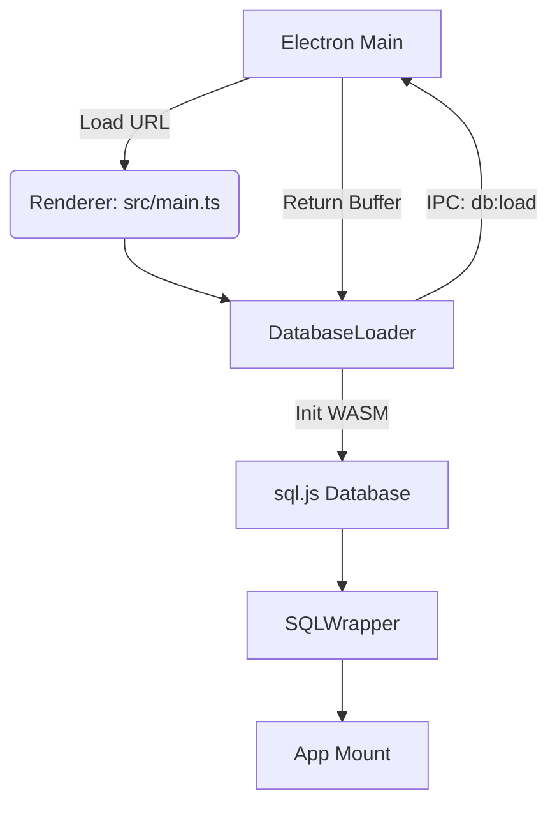

# AI 技术顾问诊断报告

**日期**: 2026年2月5日
**版本**: V1.0
**状态**: 已完成

本报告基于对 SIC-ADS 项目的深度全景扫描，涵盖技术栈分析、规范合规性审查、核心逻辑链路梳理及风险评估。

---

## 1. 全景概览 (Architecture & Stack)

### 1.1 核心架构
*   **应用类型**: 桌面端应用 (Electron)
*   **架构模式**:
    *   **前端重应用 (Thick Client)**: 绝大部分业务逻辑运行在渲染进程 (Renderer Process)。
    *   **主进程轻量化**: Electron 主进程主要负责文件 I/O、原子写入 (Atomic Write) 和系统级操作。
    *   **无服务端模式 (Local-First)**: 数据完全本地化，依赖 SQLite (WASM) 存储。

### 1.2 技术栈清单

| 模块 | 技术选型 | 说明 |
| :--- | :--- | :--- |
| **Runtime** | **Electron** | 主应用容器，通过 IPC 通讯。 |
| **Frontend** | **Vue 3** + **Vite** | 核心 UI 框架，使用 Composition API。 |
| **Language** | **TypeScript** | 全栈类型安全 (Main & Renderer)。 |
| **Database** | **sql.js (WASM)** | **[核心]** 纯 JS/WASM 版 SQLite，运行在渲染进程主线程。 |
| **State** | **Pinia** | 全局状态管理。 |
| **UI Lib** | **Element Plus** | 组件库。 |
| **Vis** | **ECharts** | 数据可视化 (`vue-echarts`)。 |
| **Office** | **docx**, **xlsx**, **jspdf** | 报表生成 (纯前端实现)。 |
| **DevOps** | **better-sqlite3** | **[仅开发环境]** 用于脚本工具 (`scripts/`)，生产环境不依赖。 |

---

## 2. 规范对齐 (Spec Compliance)

对照《重构实施技术规范.md》，审查结果如下：

### 2.1 ✅ 零原生依赖 (Zero Native Dependencies)
*   **状态**: **达标**
*   **证据**:
    *   `package.json` 中 `better-sqlite3` 被正确归类在 `devDependencies`。
    *   `electron/main.js` 未引入任何原生模块，仅使用了 Node.js 内置的 `fs`, `crypto`, `path`。
    *   生产环境完全依赖 `sql.js` (WASM)，确保了跨平台构建的稳定性。

### 2.2 ⚠️ Worker 驱动 (Worker-Driven)
*   **状态**: **降级 / 未完成**
*   **冲突点**:
    *   **数据库**: 规范要求的 "Worker 运行" 已降级为 **"Plan B: 主线程运行"**。
        *   代码证据: `src/database/sql-wrapper.ts` 明确注释 "Plan B: 主线程防抖原子写入模式"。
    *   **图像处理**: 规范要求的 `src/workers/image.worker.ts` **缺失**。
        *   当前 `src/workers` 目录下仅有 `db.worker.ts` (可能是废弃的尝试) 和相关桥接代码，未见图像处理 Worker。

### 2.3 ✅ 数据完整性 (Data Integrity)
*   **状态**: **达标**
*   **证据**:
    *   **原子写入**: `electron/main.js` 实现了 `save-database-atomic` IPC 接口，采用 `write .tmp` -> `fsync` -> `rename` 的原子操作流程。
    *   **防抖保存**: `src/database/sql-wrapper.ts` 实现了 2000ms 的防抖逻辑 (`triggerDebouncedSave`)，减少了磁盘 I/O 频率。

---

## 3. 核心逻辑链路 (Logic Flow)

### 3.1 启动与初始化链路


### 3.2 数据写入与持久化链路
```mermaid
graph LR
    User[用户操作] -->|UI Event| Biz[业务组件]
    Biz -->|SQL: INSERT/UPDATE| Wrapper[SQLWrapper (Renderer)]
    Wrapper -->|Exec In-Memory| WASM[sql.js]
    Wrapper -->|Set Dirty & Debounce 2s| Timer
    Timer -->|Timeout| Export[db.export() -> Uint8Array]
    Export -->|IPC: save-database-atomic| Main[Electron Main]
    Main -->|fs.writeFile| Tmp[.tmp File]
    Tmp -->|fs.rename| DB[database.sqlite]
```

### 3.3 核心差异 (Schema Gap)
*   **现状**: `src/database/schema.sql` 仍定义了旧的表结构 (`task`, `teacher_fav` 等)。
*   **目标**: 规范要求 `sys_training_resource`, `sys_tags` 等新表。
*   **桥梁**: `src/database/migration/migrate-to-resource.ts` 包含了完整的迁移逻辑，负责在运行时将旧数据转换为新架构。

---

## 4. 顾问诊断与风险评估 (Risk & Strategy)

### 4.1 🚨 核心风险：全量序列化性能瓶颈
*   **问题**: 当前的持久化策略 (Plan B) 是每次保存都**序列化整个数据库**并跨进程传输。
*   **影响**: 随着用户长期使用，数据库体积增长（例如达到 50MB+），每次自动保存会导致渲染进程卡顿（JS 单线程执行 `db.export()`），甚至阻塞 UI 响应。
*   **严重性**: **高** (直接影响用户体验)。

### 4.2 ⚠️ 迁移落地风险
*   **问题**: 迁移脚本 `migrate-to-resource.ts` 逻辑虽然完备，但如果不严丝合缝地集成到应用启动流程中，可能导致新旧代码对数据结构的读写冲突。
*   **现状**: 尚未看到明确的 "启动时自动执行迁移" 的集成代码 (在 `init-sqljs.ts` 或 `database-loader.ts` 中)。

---

## 5. 第一优先级建议 (Priority Recommendation)

**立即实施：增量保存或 Worker 卸载 (针对 Plan B 的优化)**

虽然规范已接受 "Plan B"，但为了避免 UI 卡顿，建议进行以下微调之一：

1.  **选项 A (Worker 导出 - 推荐)**: 虽然 SQL 执行在主线程，但 **`db.export()` 这个最耗时的操作应该放入 Web Worker**。可以将 `sql.js` 的内存状态同步给 Worker，由 Worker 负责序列化和传输给主进程。
2.  **选项 B (压缩频率)**: 增加防抖时间（例如 5秒），并仅在 `IdleCallback` (空闲时) 执行导出操作。

**下一步行动指令**: 
1. 检查 `src/database/database-loader.ts`，确保 `migrateEquipmentToResource` 迁移函数在数据库初始化后、应用挂载前被正确调用。
2. 考虑实现选项 A 或 B 来优化持久化性能。
