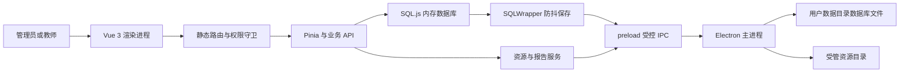
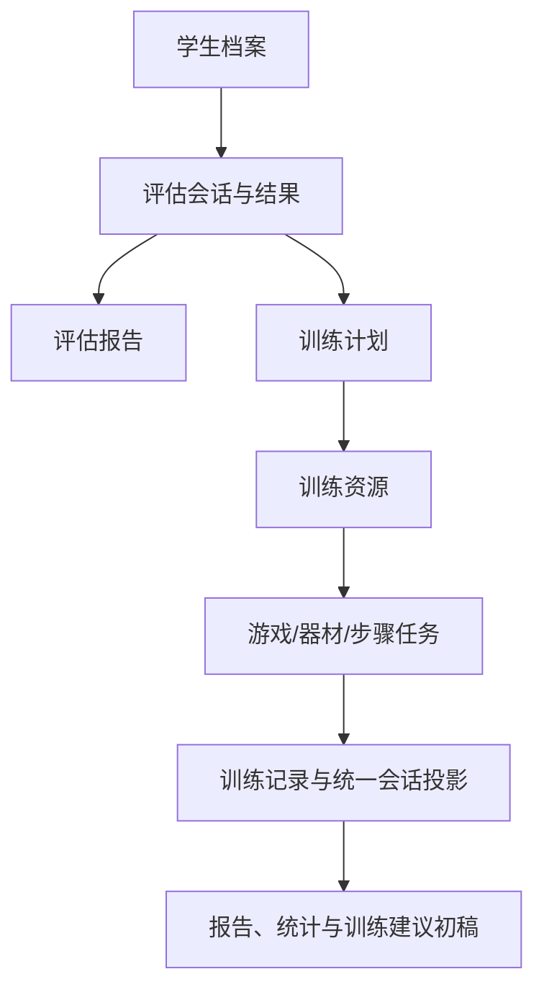

# 仓库与架构审计

审计基线 Commit：`9c44ae62ce0989b4c78fc30fafeb02004bb358b9`  
审计分支：`main`  
工作区状态：脏工作区  
审计时间：`2026-07-17 11:58:37 +08:00`  
是否包含未提交内容：是

## 一、仓库地图

本仓库是单一主应用，不是 monorepo 或 workspace。主应用约 1,594 个非生成文件，其中 `src/` 约 868 个、静态资产约 323 个、文档约 185 个、脚本约 91 个、`public/` 约 72 个、测试约 10 个、Electron 主进程相关文件约 6 个。扫描时排除了 `node_modules`、`dist`、`build`、`release`、缓存、版本库内部文件及大型媒体二进制内容。

主要目录职责：

- `src/`：Vue 页面、组件、Pinia Store、业务 API、SQL.js schema、评估驱动、训练与资源业务。
- `electron/`：桌面主进程、preload、数据库/文件/更新/AI/TTS IPC 处理。
- `scripts/` 与 `tests/`：源码契约测试、专项验证、迁移和开发工具。
- `docs/`：当前规划、架构、产品和历史交付文档；只作为意图与导航证据。
- `public/`、资产目录：内置资源、模型和训练素材。
- `license-generator-dist/` 等：许可生成相关附属产物或工具，不构成第二个在用业务应用。

## 二、技术栈与产品形态

| 维度 | 当前事实 | 证据入口 | 限制 |
|---|---|---|---|
| 产品形态 | Electron 桌面应用，渲染端为 Vue 单页应用 | `package.json`、`electron/main.mjs`、`src/main.ts` | 本次未执行安装器验收 |
| 前端 | Vue 3、TypeScript、Vite、Pinia、Vue Router、Element Plus | `package.json`、`src/main.ts` | 路由为静态表 |
| 数据库 | 渲染进程内 SQL.js | `src/database/init.ts`、`src/database/sql-wrapper.ts` | DB Worker 尚非主链 |
| 桌面持久化 | preload/IPC 将数据库字节交主进程临时文件、同步与重命名 | `electron/main.mjs`、`src/database/sql-wrapper.ts` | 仍需真实断电场景验证 |
| Web 降级 | IndexedDB 存放数据库字节 | `src/database/init.ts` | 不是本次采购承诺的多端协同能力 |
| 文件 | `resource://` 协议与用户数据目录下受管资源 | `electron/main.mjs`、资源文件服务 | 部分操作为异步尽力清理 |
| 报告 | 页面报告、Word 生成、浏览器打印、Excel 导出 | 报告组件、导出工具 | 并非所有报告均支持所有格式 |
| 更新 | electron-updater 的检查、下载、安装链路 | 更新 handler、UpdatePanel | 默认源安全与签名需确认 |
| 版本 | `1.0.5` | `package.json` | 版本号不代表所有规划模块均完成 |

## 三、进程与数据流

核心业务数据流：

上图仅表示源码已经形成的数据关联。系统未形成完整的 IEP 审批、签署、版本和归档状态机，因此没有绘制相应工作流。

## 四、前后端边界

项目没有独立远程业务后端。多数领域 API 直接在渲染进程调用 SQL.js；Electron 主进程负责本地数据库文件、资源文件、系统打开动作、升级与部分外部服务调用。内部 IPC 不等于对外开放 API，也不能据此声称支持第三方平台标准对接。

`preload` 已启用上下文隔离并关闭渲染端 Node 集成，但仍暴露通用 IPC 调用入口，BrowserWindow 的 sandbox 未启用；因此只能表述为具备基础进程隔离配置，不能表述为已经完成全面安全加固。

## 五、数据库与实体

主 schema 覆盖：学生、用户、登录日志、系统配置、激活信息、学年、班级、教师班级关系、班级历史、训练计划、游戏/器材/统一训练记录、资源与标签、收藏、教学素材、评估结果、报告记录、情绪游戏记录，以及工作区中的 AI 智能体、会话、技能和提供方配置。

数据库初始化会执行迁移与兼容处理。另有 `src/db/schema.sql` 等并行或历史数据定义，表明仓库存在新旧数据层残留；当前事实来源以 `src/database/init.ts` 及实际调用链为准。

## 六、身份、权限与授权

- 登录账户角色固定为管理员、教师两类，未实现自定义角色或任意权限编排。
- 密码采用随机盐与 PBKDF2-SHA256 派生，并拒绝旧式弱哈希直接验证。
- 管理员可进行用户增删改、启停和密码重置；内置管理员存在保护规则。
- 路由守卫同时校验登录、激活、角色和能力包；最终能力判断以 `effectiveEntitlements` 为事实来源。
- 会话标记位于本地存储且不是签名令牌。适合本地单机身份态，不应包装为服务端安全会话或单点登录。

## 七、文件、报告、备份与更新

- 资源采用统一元数据表、标签映射和 `resource://` 访问；自建资源与教学素材可进入受管目录。
- 文件替换、硬删除会检查引用并尝试清理；数据库变更与文件删除不是同一事务，异常时需健康检查或人工核验。
- 手工备份动态枚举当前业务表并加密，资源包覆盖受管的上传和教学素材目录；旧备份格式及资源恢复失败有明确限制。
- 部分评估报告支持 Word，训练记录支持 Excel，其他报告主要通过浏览器打印。报告目录中的“下载”操作实际可能转为查看，应按具体报告验收。
- 自动更新链路存在，但默认源为非加密地址且本次没有执行签名、回滚与真实升级验收，未进入公开候选参数。

## 八、模块成熟度

| 模块 | 当前状态 |
|---|---|
| 感官统合 | 当前最完整主链，含评估、训练游戏、器材、计划、记录和报告 |
| 情绪调节 | 多个场景、游戏、记录和资源编辑链可运行，但模块仍在持续补全 |
| 社交沟通 | 有授权目录、部分评估与游戏资源，不是完整独立模块 |
| 生活自理 | 有配置化步骤任务、学生选择、执行和记录；任务列表仍有阶段占位文案，不是完整模块交付 |
| 认知发展 | 有能力目录与三个 DRAFT 评估，但正式常模与专业审核不足 |
| AI 教师助手 | 工作区存在真实调用链和内置技能，但未提交且隐私边界未闭环，不纳入公开版 |

## 九、构建、测试与架构限制

- `npm run type-check`：通过。
- `npm run build:web`：通过；存在大 chunk 和静态/动态重复导入警告。
- `node --test "scripts/tests/*.test.mjs"`：167 项中 166 项通过，1 项失败；失败来自训练计划页面源码结构断言与现状不一致。
- 专项资源文件引用、生活自理退出流、加密字节测试：通过。
- 授权目录 TypeScript 测试：失败；测试仍期待能力状态为 `placeholder`，当前代码为 `active`。

关键限制：DB Worker 与 Image Worker 尚非主链；注册表未驱动动态路由；无正式容量压测；无完整操作审计；无多学校/多租户数据隔离；无对外开放接口；未验证跨平台安装；自动更新安全需复核。

