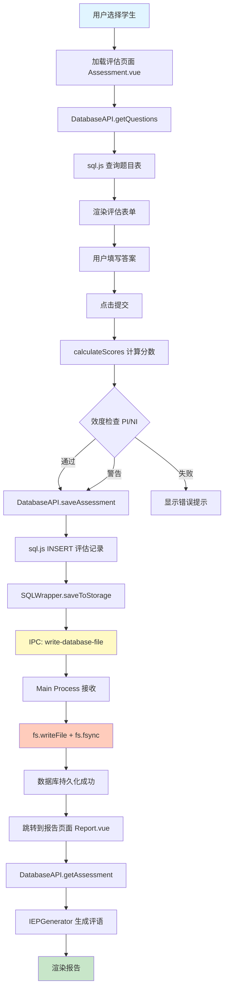
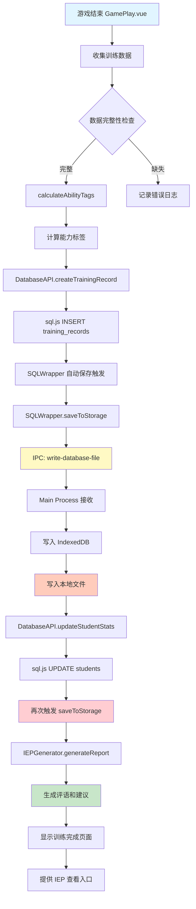
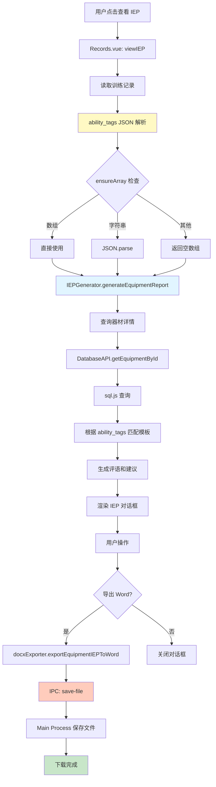
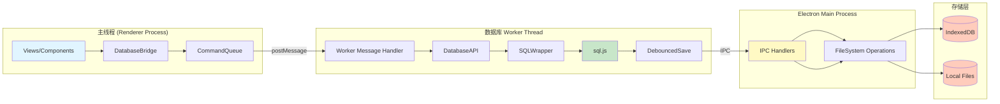
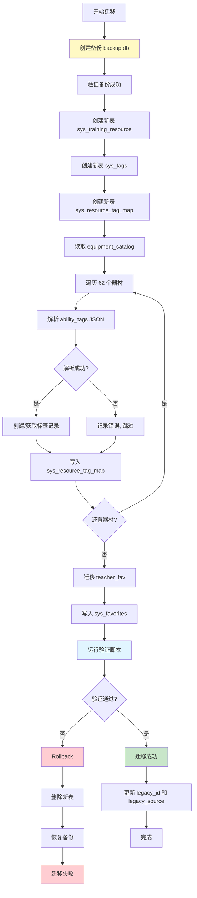
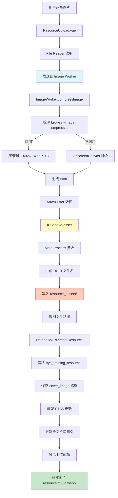
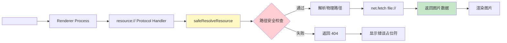
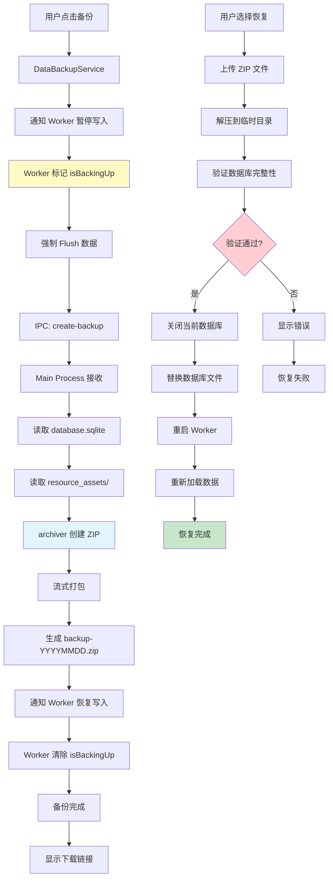

# SIC-ADS 数据流图 (Data Flow Diagram)

**文档日期**: 2026-02-05
**适用阶段**: Phase 2.0 重构
**绘制工具**: Mermaid Diagram

---

## 1. 评估创建流程 (Assessment Creation Flow)



### 关键 IPC 通讯点

| 位置 | IPC Channel | 数据大小 | 频率 |
|:-----|:------------|:---------|:-----|
| `saveToStorage()` | `write-database-file` | 1-5 MB | 每次 |
| `exportReport()` | `save-file` | 100-500 KB | 按需 |

---

## 2. 训练记录写入流程 (Training Record Write Flow)



### 性能瓶颈分析

| 环节 | 当前耗时 | 优化后耗时 | 优化方案 |
|:-----|:---------|:----------|:---------|
| `calculateAbilityTags()` | 50-100ms | 50-100ms | 无需优化 |
| `createTrainingRecord()` | 10-20ms | 10-20ms | 无需优化 |
| `saveToStorage()` 第1次 | 100-300ms | **批量后** | 防抖合并 |
| `saveToStorage()` 第2次 | 100-300ms | **跳过** | 2秒内合并 |
| `updateStudentStats()` | 20-50ms | 20-50ms | 无需优化 |

### 优化方案：防抖保存

```typescript
// 当前流程
INSERT training_records → saveToStorage → IPC (100-300ms)
UPDATE students → saveToStorage → IPC (100-300ms)
// 总耗时: 200-600ms

// 优化后流程
INSERT training_records → 标记 Dirty (0ms)
UPDATE students → 标记 Dirty (0ms)
→ 2秒防抖后 → 一次性 saveToStorage → IPC (100-300ms)
// 总耗时: 100-300ms (节省 50%+)
```

---

## 3. 器材训练 IEP 生成流程 (Equipment IEP Generation Flow)



### ability_tags 解析风险点

| 位置 | 操作 | 风险 | 缓解措施 |
|:-----|:-----|:-----|:---------|
| `Records.vue:230` | `JSON.parse(record.ability_tags)` | 中 | 已在 try-catch 中 |
| `Records.vue:293` | `ensureArray(record.ability_tags)` | 低 | 函数已保护 |
| `Records.vue:371` | `ensureArray(record.ability_tags)` | 低 | 函数已保护 |
| `Records.vue:461` | `ensureArray(record.ability_tags)` | 低 | 函数已保护 |

---

## 4. 重构后的数据库架构流程 (Refactored Database Architecture)



### Worker 通讯优化

**模式 1: 单次查询**
```typescript
// 主线程
const result = await bridge.query('SELECT * FROM students')

// Worker
postMessage({ id: 1, result: [...] })
```

**模式 2: 批量查询（优化）**
```typescript
// 主线程
const results = await bridge.batch([
  { sql: 'SELECT * FROM students', params: [] },
  { sql: 'SELECT * FROM training_records', params: [] }
])

// Worker
postMessage({ id: 1, results: [[...], [...]] })
```

---

## 5. 数据迁移流程 (Data Migration Flow)



### 迁移验证检查点

| 检查项 | SQL 查询 | 预期结果 |
|:-------|:---------|:---------|
| 资源数量 | `SELECT COUNT(*) FROM sys_training_resource` | = 62 |
| 标签数量 | `SELECT COUNT(*) FROM sys_tags` | > 0 |
| 关联数量 | `SELECT COUNT(*) FROM sys_resource_tag_map` | > 0 |
| 收藏数量 | `SELECT COUNT(*) FROM sys_favorites` | = 原 teacher_fav 数量 |
| legacy_id | `SELECT COUNT(*) FROM sys_training_resource WHERE legacy_id IS NOT NULL` | = 62 |

---

## 6. 资源上传流程 (Resource Upload Flow)



### resource:// 协议处理流程



### 安全检查点

| 检查项 | 代码 | 防御 |
|:-------|:-----|:-----|
| 路径遍历 | `../` 检测 | `path.resolve()` + 前缀校验 |
| 目录访问 | 检查是否为目录 | `fs.statSync().isFile()` |
| 路径注入 | 特殊字符过滤 | 正则校验 `^[a-zA-Z0-9-_.]+$` |

---

## 7. 备份恢复流程 (Backup & Restore Flow)



---

## 8. IPC 通讯汇总表 (IPC Communication Summary)

| IPC Channel | 方向 | 数据大小 | 频率 | 阻塞风险 |
|:------------|:-----|:---------|:-----|:---------|
| `write-database-file` | Renderer → Main | 1-5 MB | 高 | 中 |
| `read-database-file` | Renderer → Main | 1-5 MB | 中 | 中 |
| `save-file` | Renderer → Main | 100-500 KB | 低 | 低 |
| `read-file-as-base64` | Renderer → Main | 100-500 KB | 高 | 中 |
| `save-asset` | Renderer → Main | 50-200 KB | 中 | 低 |
| `delete-asset` | Renderer → Main | < 1 KB | 低 | 无 |
| `create-backup` | Renderer → Main | 1-10 MB | 低 | 高 |
| `restore-backup` | Renderer → Main | 1-10 MB | 极低 | 高 |

### 优化建议

1. **write-database-file**: 实施防抖 + 批量
2. **read-file-as-base64**: 改用 `resource://` 协议
3. **create-backup**: 使用流式处理，避免内存溢出

---

**文档生成时间**: 2026-02-05
**相关文档**: `docs/audit-report.md`, `重构实施技术规范.md`
**维护者**: 首席实施工程师
