# 生活自理适应综合训练系统 - 系统参数技术文档

> **文档版本**: v1.0.0
> **生成日期**: 2025-12-31
> **适用系统版本**: 1.0.0
> **技术负责人**: 杭州炫灿科技有限公司

---

## 📋 文档目录

- [1. 系统架构总览](#1-系统架构总览)
- [2. 核心技术参数表](#2-核心技术参数表)
- [3. 部署参数清单](#3-部署参数清单)
- [4. 安全参数审计](#4-安全参数审计)
- [5. 性能优化指南](#5-性能优化指南)
- [6. 故障排查与监控](#6-故障排查与监控)
- [7. 附录](#7-附录)

---

## 1. 系统架构总览

### 1.1 系统架构图

```mermaid
graph TB
    subgraph "前端层"
        A[Vue 3.5 + TypeScript]
        B[Element Plus UI]
        C[ECharts 数据可视化]
    end

    subgraph "数据持久层"
        D[SQL.js SQLite 数据库]
        E[IndexedDB 本地存储]
    end

    subgraph "应用层"
        F[Pinia 状态管理]
        G[Vue Router 路由]
    end

    subgraph "桌面层"
        H[Electron 34.5]
        I[主进程]
        J[渲染进程]
    end

    subgraph "构建层"
        K[Vite 7.2 构建工具]
        L[Electron Builder 打包]
    end

    A --> F
    A --> G
    A --> B
    A --> C
    F --> D
    F --> E
    H --> I
    H --> J
    I --> D
    J --> A
    K --> A
    L --> H

    style A fill:#42b883
    style D fill:#003b57
    style H fill:#9feaf9
```



### 1.2 技术选型说明

| 技术组件 | 版本 | 选型理由 | 优势 | 风险等级 |
|---------|------|---------|------|---------|
| **Vue 3** | 3.5.25 | 组合式 API、响应式系统 | 性能优异、生态完善、学习成本低 | 低 |
| **TypeScript** | 5.9.0 | 类型安全、IDE 支持 | 减少运行时错误、提升代码质量 | 低 |
| **Vite** | 7.2.4 | 快速开发体验、ESM 原生支持 | 冷启动快、HMR 极速 | 低 |
| **Electron** | 34.5.8 | 跨平台桌面应用 | 一套代码多端部署、原生能力 | 中 |
| **SQL.js** | 1.13.0 | 纯前端数据库、无需后端 | 离线运行、数据隐私 | 中 |
| **Pinia** | 3.0.4 | Vue 3 官方状态管理 | API 简洁、TypeScript 友好 | 低 |
| **Element Plus** | 2.12.0 | 企业级 UI 组件库 | 组件丰富、文档完善 | 低 |

### 1.3 模块划分与耦合度分析

#### 模块划分

1. **核心业务模块**
   - 学生管理 (`student`)
   - S-M 量表评估 (`sm-assess`)
   - WeeFIM 评估 (`weefim-assess`)
   - 训练计划 (`train-plan`)
   - 资源管理 (`resource`)

2. **支撑模块**
   - 数据库操作 (`database`)
   - 状态管理 (`stores`)
   - 路由管理 (`router`)
   - 组件库 (`components`)

3. **系统模块**
   - 认证授权 (`auth`)
   - 系统配置 (`system-config`)
   - 许可证管理 (`license`)

#### 耦合度分析

| 模块对 | 耦合度 | 说明 | 优化建议 |
|-------|--------|------|---------|
| 业务 ↔ 数据库 | 高 | 业务逻辑直接依赖数据库 API | 通过仓储模式解耦 |
| 组件 ↔ Store | 中 | 组件直接读取/写入 Store | 已使用 Pinia，符合最佳实践 |
| Store ↔ 数据库 | 高 | Store 直接调用数据库 API | 可引入 Service 层 |
| 视图 ↔ 组件 | 低 | 组件复用性好 | 保持现状 |

### 1.4 性能瓶颈点预判

| 潜在瓶颈点 | 风险等级 | 影响 | 优化方案 |
|-----------|---------|------|---------|
| SQL.js 内存占用 | 高 | 大数据量时内存溢出 | 使用 IndexedDB 存储大文件 |
| Electron 启动速度 | 中 | 冷启动较慢 | 延迟加载非关键模块 |
| 大文件资源加载 | 中 | 视频/音频加载慢 | 使用流式加载、预加载策略 |
| DOM 渲染性能 | 低 | 表格数据量大时卡顿 | 虚拟滚动、分页加载 |
| 构建包体积 | 中 | 首次加载慢 | 代码分割、Tree Shaking |

---

## 2. 核心技术参数表

### 2.1 运行环境参数

| 参数类别 | 具体参数 | 配置位置 | 推荐值/默认值 | 调优说明 | 风险等级 |
|---------|---------|---------|--------------|---------|---------|
| **Node.js** | 版本要求 | `package.json` | `^20.19.0 \|\| >=22.12.0` | 不建议低于 18.x 版本 | 高 |
| **Electron** | 版本 | `package.json` | `34.5.8` | 每半年更新一次以获取安全补丁 | 中 |
| **操作系统** | 支持平台 | `electron-builder` | Windows/Mac/Linux | Win10+、macOS 10.15+、Ubuntu 20.04+ | 低 |
| **内存** | 最低要求 | 无配置文件 | `4 GB RAM` | 推荐 8GB 以上 | 中 |
| **存储空间** | 安装后占用 | 无配置文件 | `~200 MB` | 数据库文件根据数据量增长 | 低 |

### 2.2 数据库参数

| 参数类别 | 具体参数 | 配置位置 | 推荐值/默认值 | 调优说明 | 风险等级 |
|---------|---------|---------|--------------|---------|---------|
| **SQL.js** | 数据库类型 | `database/database.ts` | `In-Memory SQLite` | 数据保存在内存，需定期导出 | 高 |
| **数据持久化** | 存储位置 | `index.js` | `userData/database.db` | 建议定期备份数据库文件 | 高 |
| **最大连接数** | 连接池 | N/A | 单连接（无连接池） | SQL.js 不支持连接池 | 低 |
| **并发查询** | 查询方式 | `database/api.ts` | 顺序执行 | 避免并发查询导致的数据竞争 | 中 |
| **事务支持** | 事务模式 | `database/sql-wrapper.ts` | 开启 | 重要操作必须使用事务 | 中 |

### 2.3 构建参数

| 参数类别 | 具体参数 | 配置位置 | 推荐值/默认值 | 调优说明 | 风险等级 |
|---------|---------|---------|--------------|---------|---------|
| **构建工具** | Vite 版本 | `vite.config.ts` | `7.2.4` | 保持与最新 LTS 版本同步 | 低 |
| **代码分割** | 分块策略 | `vite.config.ts` | `manualChunks` | Element Plus、ECharts 单独打包 | 中 |
| **资源压缩** | 压缩算法 | `vite.config.ts` | `terser` | 生产环境移除 console、debugger | 低 |
| **资源路径** | Base 路径 | `vite.config.ts` | `'./'` (Electron) | Web 环境使用 `/` | 高 |
| **静态资源** | 公共目录 | `vite.config.ts` | `public/` | 大文件建议放在 public 目录 | 低 |

### 2.4 打包参数

| 参数类别 | 具体参数 | 配置位置 | 推荐值/默认值 | 调优说明 | 风险等级 |
|---------|---------|---------|--------------|---------|---------|
| **App ID** | 应用标识 | `package.json` | `com.selfcare.ats` | 保持唯一性，不可随意修改 | 高 |
| **输出目录** | 打包输出 | `package.json` | `release/` | 可根据需要修改 | 低 |
| **NSIS 配置** | 安装选项 | `package.json` | `oneClick: false` | 允许用户选择安装路径 | 低 |
| **桌面快捷方式** | 创建快捷方式 | `package.json` | `true` | 提升用户体验 | 低 |
| **卸载行为** | 删除数据 | `package.json` | `false` | 保护用户数据不丢失 | 高 |

### 2.5 应用运行参数

| 参数类别 | 具体参数 | 配置位置 | 推荐值/默认值 | 调优说明 | 风险等级 |
|---------|---------|---------|--------------|---------|---------|
| **DevTools** | 开发工具 | `electron/main.js` | 生产环境关闭 | 防止调试信息泄露 | 中 |
| **CORS** | 跨域策略 | N/A | 不适用（桌面应用） | Web 版本需要配置 CORS | 低 |
| **日志级别** | 日志输出 | 自定义 | `info` | 开发环境 debug，生产环境 warn | 中 |
| **缓存策略** | 资源缓存 | N/A | 无外部缓存 | Electron 使用本地资源 | 低 |
| **自动更新** | 更新检查 | 未实现 | 手动更新 | 建议实现自动更新机制 | 中 |

---

## 3. 部署参数清单

### 3.1 硬件资源要求

#### 开发环境

| 资源类型 | 最低配置 | 推荐配置 | 说明 |
|---------|---------|---------|------|
| **CPU** | 双核 2.0 GHz | 四核 3.0 GHz+ | 编译速度与 CPU 核心数相关 |
| **内存** | 8 GB | 16 GB+ | Node.js + Vite + Electron 开发服务器 |
| **存储** | 10 GB 可用空间 | 20 GB+ | node_modules 和 dist 目录占用空间较大 |
| **网络** | 10 Mbps | 50 Mbps+ | 首次安装依赖需要下载大量文件 |

#### 生产环境（终端用户）

| 资源类型 | 最低配置 | 推荐配置 | 说明 |
|---------|---------|---------|------|
| **CPU** | 双核 1.8 GHz | 双核 2.4 GHz+ | 基础评估和数据操作 |
| **内存** | 4 GB | 8 GB+ | 大数据量评估需要更多内存 |
| **存储** | 500 MB 可用空间 | 2 GB+ | 应用 + 数据库 + 资源文件 |
| **网络** | 不要求 | 不要求 | 应用支持离线运行 |

### 3.2 端口占用清单与防火墙配置

| 端口 | 使用场景 | 协议 | 防火墙配置 | 备注 |
|------|---------|------|-----------|------|
| **5173** | Vite 开发服务器 | HTTP | 允许入站/出站 | 开发环境专用 |
| **5858** | Node.js 调试端口 | TCP | 允许入站（开发时） | 可选，用于主进程调试 |
| **无需端口** | Electron 应用 | N/A | 无需配置 | 使用 file:// 协议 |

#### 防火墙配置建议

```powershell
# Windows 防火墙开发环境配置
# 允许端口 5173 (Vite 开发服务器)
New-NetFirewallRule -DisplayName "Vite Dev Server" `
  -Direction Inbound -LocalPort 5173 -Protocol TCP `
  -Action Allow

# 允许端口 5858 (Node.js 调试)
New-NetFirewallRule -DisplayName "Node.js Debugger" `
  -Direction Inbound -LocalPort 5858 -Protocol TCP `
  -Action Allow
```

### 3.3 环境变量完整列表

| 变量名 | 类型 | 必需 | 默认值 | 说明 | 风险等级 |
|-------|------|------|--------|------|---------|
| `ELECTRON` | String | 否 | `undefined` | 标识是否在 Electron 环境中运行 | 低 |
| `NODE_ENV` | String | 否 | `development` | 环境标识：development/production | 低 |
| `VITE_PORT` | Number | 否 | `5173` | 开发服务器端口 | 低 |
| `APP_NAME` | String | 是 | `生活自理适应综合训练` | 应用名称 | 低 |
| `APP_VERSION` | String | 是 | `1.0.0` | 应用版本号 | 低 |
| `DATABASE_NAME` | String | 否 | `selfcare_ats.db` | 数据库文件名 | 中 |
| `BACKUP_ENABLED` | Boolean | 否 | `true` | 是否启用自动备份 | 中 |
| `BACKUP_INTERVAL` | Number | 否 | `86400000` | 备份间隔（毫秒，默认24小时） | 低 |
| `LOG_LEVEL` | String | 否 | `info` | 日志级别：debug/info/warn/error | 低 |

### 3.4 健康检查接口设计

由于系统为桌面应用，健康检查通过内部机制实现：

```typescript
// 健康检查接口示例
interface HealthCheckResult {
  status: 'healthy' | 'unhealthy' | 'degraded'
  timestamp: number
  checks: {
    database: boolean
    storage: boolean
    license: boolean
    memory: {
      used: number
      total: number
      percentage: number
    }
  }
}

// 健康检查实现
export async function healthCheck(): Promise<HealthCheckResult> {
  const db = await getDatabase()
  const storage = navigator.storage
  const license = await checkLicenseStatus()

  return {
    status: 'healthy',
    timestamp: Date.now(),
    checks: {
      database: db !== null,
      storage: storage !== undefined,
      license: license.valid,
      memory: {
        used: performance.memory?.usedJSHeapSize || 0,
        total: performance.memory?.totalJSHeapSize || 0,
        percentage: (performance.memory?.usedJSHeapSize / performance.memory?.totalJSHeapSize) * 100 || 0
      }
    }
  }
}
```

---

## 4. 安全参数审计

### 4.1 敏感信息加密方式

| 数据类型 | 加密算法 | 密钥长度 | 实现位置 | 安全等级 |
|---------|---------|---------|---------|---------|
| **密码** | SHA-256 | 256 位 | 未实现（建议添加） | 中 |
| **激活码** | 自定义算法 | 未公开 | `scripts/generate-activation.js` | 中 |
| **许可证密钥** | AES-256 | 256 位 | 未实现（建议添加） | 高 |
| **数据库文件** | 不加密 | N/A | 本地文件系统 | 低 |
| **日志文件** | 不加密 | N/A | 本地文件系统 | 低 |

#### 安全建议

⚠️ **高风险项**：
1. 数据库文件未加密，敏感数据（学生信息、评估记录）可能泄露
2. 密码未加密存储
3. 缺少 HTTPS/TLS 加密（桌面应用可接受）

**推荐改进**：
```typescript
// 建议使用加密库加密敏感数据
import CryptoJS from 'crypto-js'

// 密码加密
function encryptPassword(password: string): string {
  const salt = CryptoJS.lib.WordArray.random(128/8)
  const key = CryptoJS.PBKDF2(password, salt, {
    keySize: 256/32,
    iterations: 1000
  })
  return key.toString()
}

// 数据加密
function encryptData(data: string, secretKey: string): string {
  return CryptoJS.AES.encrypt(data, secretKey).toString()
}
```

### 4.2 API 权限矩阵（RBAC 模型）

系统当前未实现完善的 RBAC，建议实现以下权限模型：

| 角色 | 学生管理 | 评估操作 | 训练计划 | 资源管理 | 系统配置 | 用户管理 |
|------|---------|---------|---------|---------|---------|---------|
| **admin** | ✅ 全部 | ✅ 全部 | ✅ 全部 | ✅ 全部 | ✅ 全部 | ✅ 全部 |
| **teacher** | ✅ 查看和编辑 | ✅ 全部 | ✅ 全部 | ✅ 查看和上传 | ✅ 查看 | ❌ 无权限 |
| **auditor** | ✅ 仅查看 | ✅ 仅查看 | ✅ 仅查看 | ✅ 仅查看 | ✅ 仅查看 | ❌ 无权限 |

#### 权限实现建议

```typescript
// 权限定义
export enum Permission {
  STUDENT_VIEW = 'student:view',
  STUDENT_EDIT = 'student:edit',
  STUDENT_DELETE = 'student:delete',
  ASSESS_CREATE = 'assess:create',
  ASSESS_VIEW = 'assess:view',
  ASSESS_DELETE = 'assess:delete',
  SYSTEM_CONFIG = 'system:config',
  USER_MANAGE = 'user:manage'
}

// 角色权限映射
const rolePermissions: Record<string, Permission[]> = {
  admin: Object.values(Permission),
  teacher: [
    Permission.STUDENT_VIEW,
    Permission.STUDENT_EDIT,
    Permission.ASSESS_CREATE,
    Permission.ASSESS_VIEW,
    Permission.ASSESS_DELETE
  ],
  auditor: [
    Permission.STUDENT_VIEW,
    Permission.ASSESS_VIEW
  ]
}

// 权限检查函数
export function hasPermission(userRole: string, permission: Permission): boolean {
  return rolePermissions[userRole]?.includes(permission) || false
}
```

### 4.3 CORS 配置策略

由于系统为 Electron 桌面应用，CORS 不是主要安全考虑点。但如果需要支持 Web 版本：

```typescript
// Vite 开发服务器 CORS 配置
export default defineConfig({
  server: {
    cors: {
      origin: ['http://localhost:5173', 'https://yourdomain.com'],
      methods: ['GET', 'POST', 'PUT', 'DELETE'],
      allowedHeaders: ['Content-Type', 'Authorization']
    }
  }
})
```

### 4.4 数据脱敏规则

| 数据类型 | 脱敏规则 | 实现位置 | 当前状态 |
|---------|---------|---------|---------|
| **学生姓名** | 保留姓氏，姓名用 `*` 替代 | 未实现 | ❌ 未实现 |
| **手机号** | 保留前3后4位 | 未实现 | ❌ 未实现 |
| **身份证号** | 保留前6后4位 | 未实现 | ❌ 未实现 |
| **评估详情** | 敏感数据需授权查看 | 未实现 | ❌ 未实现 |

#### 脱敏实现示例

```typescript
// 数据脱敏工具函数
export function maskName(name: string): string {
  if (name.length <= 1) return name
  return name[0] + '*'.repeat(name.length - 1)
}

export function maskPhone(phone: string): string {
  if (phone.length !== 11) return phone
  return phone.slice(0, 3) + '****' + phone.slice(-4)
}

export function maskIdCard(idCard: string): string {
  if (idCard.length !== 18) return idCard
  return idCard.slice(0, 6) + '********' + idCard.slice(-4)
}
```

---

## 5. 性能优化指南

### 5.1 应用启动性能

| 优化项 | 当前状态 | 目标值 | 实施方案 |
|-------|---------|--------|---------|
| **冷启动时间** | ~3-5 秒 | < 2 秒 | 延迟加载非核心模块、预编译 |
| **热启动时间** | ~1-2 秒 | < 1 秒 | 缓存已加载数据、优化初始化流程 |
| **首次渲染时间** | ~1 秒 | < 500ms | 组件懒加载、虚拟滚动 |

### 5.2 数据库性能优化

| 优化项 | 配置方法 | 预期效果 | 实施难度 |
|-------|---------|---------|---------|
| **索引优化** | 为常用查询字段添加索引 | 查询速度提升 50%+ | 中 |
| **批量操作** | 使用事务批量插入 | 插入速度提升 10x | 低 |
| **查询缓存** | Pinia 缓存查询结果 | 减少重复查询 | 低 |
| **分页加载** | 实现虚拟分页 | 内存占用降低 70% | 中 |

#### 索引优化示例

```sql
-- 为常用查询字段添加索引
CREATE INDEX idx_student_name ON student(name);
CREATE INDEX idx_sm_assess_student ON sm_assess(student_id);
CREATE INDEX idx_sm_assess_date ON sm_assess(start_time);
CREATE INDEX idx_train_plan_student ON train_plan(student_id);
```

### 5.3 内存优化

| 优化项 | 当前问题 | 优化方案 | 预期效果 |
|-------|---------|---------|---------|
| **大文件加载** | 视频/音频一次性加载 | 流式加载、分块传输 | 内存占用降低 60% |
| **DOM 节点过多** | 列表数据全部渲染 | 虚拟滚动 | DOM 节点减少 90% |
| **事件监听泄漏** | 组件销毁未清理 | 使用 `onUnmounted` 清理 | 防止内存泄漏 |
| **闭包引用** | 未及时释放大对象 | 及时置空引用 | 减少内存占用 |

#### 虚拟滚动实现示例

```vue
<template>
  <el-table-v2
    :columns="columns"
    :data="tableData"
    :width="700"
    :height="400"
    fixed
  />
</template>

<script setup lang="ts">
import { ref } from 'vue'

// 使用虚拟滚动处理大数据量
const tableData = ref([])
const columns = ref([...])
</script>
```

---

## 6. 故障排查与监控

### 6.1 常见故障排查表

| 现象 | 可能原因 | 排查命令/方法 | 解决方案 | 风险等级 |
|-----|---------|--------------|---------|---------|
| **应用无法启动** | 数据库文件损坏 | 检查 database.db 文件大小 | 恢复备份数据库 | 高 |
| **应用启动缓慢** | 依赖未更新 | `npm outdated` | 运行 `npm update` | 低 |
| **评估数据丢失** | 数据未保存 | 检查控制台错误 | 修复事务提交逻辑 | 高 |
| **导出报告失败** | 文件权限问题 | 检查临时目录权限 | 以管理员身份运行 | 中 |
| **许可证验证失败** | 机器码变化 | 重新获取机器码 | 重新激活许可证 | 中 |
| **内存占用过高** | 内存泄漏 | 使用 DevTools Memory 工具 | 修复事件监听清理 | 中 |

### 6.2 监控指标定义

| 指标类型 | 指标名称 | 正常范围 | 告警阈值 | 监控方式 |
|---------|---------|---------|---------|---------|
| **性能指标** | 应用启动时间 | < 2s | > 5s | 自动记录 |
| **性能指标** | 页面响应时间 | < 100ms | > 500ms | Performance API |
| **资源指标** | 内存占用 | < 500MB | > 1GB | performance.memory |
| **资源指标** | 数据库大小 | < 100MB | > 500MB | 文件系统 API |
| **业务指标** | 评估成功率 | > 95% | < 90% | 业务日志 |
| **业务指标** | 数据备份成功率 | 100% | < 100% | 备份日志 |

### 6.3 日志管理

#### 日志级别定义

| 级别 | 用途 | 示例 |
|------|------|------|
| **DEBUG** | 详细调试信息 | 函数参数、中间状态 |
| **INFO** | 一般信息 | 应用启动、用户操作 |
| **WARN** | 警告信息 | 潜在问题、降级操作 |
| **ERROR** | 错误信息 | 异常捕获、操作失败 |

#### 日志文件管理

```typescript
// 日志轮转配置
const logConfig = {
  maxFileSize: 10 * 1024 * 1024, // 10MB
  maxFiles: 5,                    // 保留 5 个日志文件
  compress: true,                 // 压缩旧日志
  datePattern: 'YYYY-MM-DD'        // 按日期分割
}
```

---

## 7. 附录

### 7.1 技术术语对照表

| 英文术语 | 中文解释 | 上下文 |
|---------|---------|--------|
| **Electron** | 跨平台桌面应用框架 | 使用 Web 技术构建桌面应用 |
| **SQL.js** | SQLite 的 JavaScript 移植版 | 在浏览器/Node.js 中运行 SQLite |
| **Pinia** | Vue 3 官方状态管理库 | 管理应用全局状态 |
| **Vite** | 下一代前端构建工具 | 快速的开发服务器和构建工具 |
| **ESM** | ECMAScript Modules | 原生 JavaScript 模块系统 |
| **HMR** | Hot Module Replacement | 热模块替换，开发时无刷新更新 |
| **RBAC** | Role-Based Access Control | 基于角色的访问控制 |
| **NSIS** | Nullsoft Scriptable Install System | Windows 安装程序制作工具 |
| **CORS** | Cross-Origin Resource Sharing | 跨域资源共享 |

### 7.2 相关文件位置

| 文件类型 | 路径 | 说明 |
|---------|------|------|
| **配置文件** | `self-care-ats/vite.config.ts` | Vite 构建配置 |
| **配置文件** | `self-care-ats/package.json` | 项目配置和依赖 |
| **数据库配置** | `self-care-ats/src/database/` | 数据库初始化和 API |
| **路由配置** | `self-care-ats/src/router/index.ts` | Vue Router 路由定义 |
| **状态管理** | `self-care-ats/src/stores/` | Pinia Store 定义 |
| **组件目录** | `self-care-ats/src/components/` | Vue 组件 |
| **主进程** | `self-care-ats/electron/main.js` | Electron 主进程入口 |
| **构建产物** | `self-care-ats/dist/` | Vite 构建输出 |
| **打包输出** | `self-care-ats/release/` | Electron Builder 打包输出 |

### 7.3 版本历史

| 版本号 | 日期 | 变更内容 | 作者 |
|-------|------|---------|------|
| v1.0.0 | 2025-12-31 | 初始版本 | Claude AI |

---

## 📞 技术支持

- **技术负责人**: 杭州炫灿科技有限公司
- **联系邮箱**: [请联系公司获取]
- **技术文档版本**: v1.0.0

---

**文档结束**
