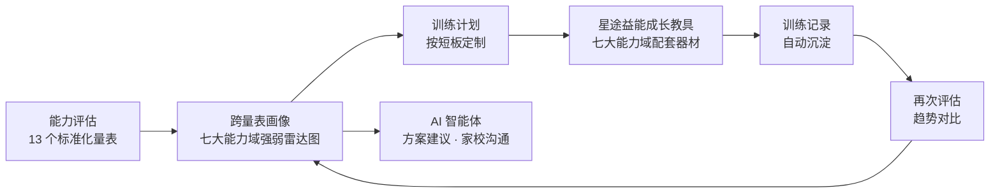

# SCGP 星愿能力发展平台 · 营销文章合集（2026-08 版）

> 适用产品：SCGP / 星愿能力发展平台
> 本文用途：官网 / 公众号 / 招商材料 / 客户演示 / 朋友圈 / 抖音 / 小红书
> 配套版本：本合集含【正式版】【口语版】两套完整文章 + 短篇引流文案
> 事实基线：6 大业务模块、13 个支持纵向分析与画像的标准化量表、6 个内置 AI 智能体、评估纵向趋势、跨量表画像、训练闭环、星途益能成长教具（配套器材体系）、班级与系统管理

---

# 第一部分 · 正式版（官网 / 招商 / 方案用）

# SCGP 星愿能力发展平台：从测评到干预的特殊儿童能力发展闭环系统

## 一、产品概述

SCGP 星愿能力发展平台是一套面向特殊教育、融合教育与资源教室场景的**儿童能力发展支持系统**，由三大支柱构成：

1. **能力发展软件**：覆盖"**评估—画像—计划—训练—记录—沟通**"全流程的数据闭环平台；
2. **星途益能成长教具**：与软件能力一一配套的专业干预器材体系（感官能力、精细动作、情绪行为、安抚教具、粗大动作、社交沟通、认知能力七大能力域）；
3. **AI 智能体团队**：6 个内置智能体把专业方法带到教师每天的工作台上。

三者不是拼凑，而是**深度联动**：评估发现短板 → 画像定位优势与弱势 → 系统推荐对应能力的器材与训练 → 训练记录沉淀为下一次评估的依据。软件、教具、AI 三位一体，构成普通测评软件无法复制的完整闭环。

平台采用**本地优先**架构：学生档案、评估记录、训练记录全部存储在校内本地数据库，数据不出校，安全可控，无需依赖公网即可完成核心业务。

## 二、系统主要能力

### 1. 能力评估（13 个标准化量表）

- **感觉统合**：CSIRS 儿童感觉统合能力发展评定量表、CNBS-R2016 儿童发育行为评估（儿心量表Ⅱ）
- **行为与情绪**：Conners 父母问卷（PSQ）、Conners 教师问卷（TRS）、CBCL 儿童行为量表、SDQ 长处和困难问卷
- **社交沟通**：SRS-2 社交反应量表
- **执行功能**：BRIEF 执行功能行为评定量表
- **运动发展**：GMFM-88 粗大运动功能评定量表、TGMD-3 大肌肉动作发展测验、FMDA 小肌肉功能发展评估量表
- **生活自理**：S-M 婴儿-初中生社会生活能力量表、WeeFIM 儿童功能独立性评定量表

全部量表**电子化评估、自动计分、自动出报告、自动归档**，告别手工计分与纸质档案。

### 2. 评估纵向趋势分析（平台特色）

同一量表历次评估自动生成**纵向趋势图**：总分与各维度随时间的升降一目了然。孩子较上次是进步还是退步、哪个维度在改善、哪个在滑坡——不再依赖老师记忆，全部由数据呈现。

### 3. 跨量表学生画像（平台特色）

孩子完成多类量表后，系统聚合生成**跨量表学生画像**：感觉统合、情绪调节、社交沟通、认知发展、生活自理五大发展领域的强弱雷达图，并自动发现跨量表一致性线索（如社交量表偏低与感觉统合特定维度偏低互相印证），为干预优先级提供数据依据。

### 4. 五大发展领域训练模块

- **感官统合训练**：游戏训练 + 器材训练
- **情绪调节**：情绪场景训练、安抚表达训练、20 余款情绪主题小游戏
- **社交沟通**：双人协作、表情识别、沟通表达类游戏
- **认知发展**：逻辑推理、记忆、序列、视知觉等认知游戏
- **生活自理**：洗手、刷牙、穿脱、进餐等生活技能场景训练

每个模块均提供**游戏训练**与**器材训练**双通道，训练过程自动记录。

### 5. 训练计划与训练记录

- **训练计划**：按学生个别化目标制定训练计划，任务分解到天，执行状态可跟踪；
- **统一训练记录**：游戏、器材、情绪、生活自理等多来源训练记录沉淀为统一主表，按学生、模块、时间多维检索；
- **报告生成**：评估报告、IEP 报告、训练总结一键导出为 Word 文档。

### 6. 星途益能成长教具（配套器材体系）

平台配套的实物器材命名为**「星途益能成长教具」**，是公司特教专业团队精挑细选配置的专业干预器材体系——**不是随意采购的通用玩具，而是与软件能力一一配套的完整体系**。

每套器材与平台的七大能力域一一对应、无缝衔接：

- **感官能力**：触觉、前庭觉、本体觉、视觉、听觉等感官通道训练器材；
- **精细动作**：抓握、手眼协调、双手协作等精细操作器材；
- **情绪行为**：情绪识别、自我调节、宣泄安抚类器材；
- **安抚教具**：深压安抚、安全感建立等安抚类教具；
- **粗大动作**：平衡、核心力量、动态平衡等大运动器材；
- **社交沟通**：社交互动、轮流规则、合作类器材；
- **认知能力**：逻辑思维、因果推理、配对记忆等认知类器材。

器材按**感官分类 + 能力标签**组织，与软件中的评估维度、训练计划、能力画像直接联动——评估发现短板，系统推荐对应能力的器材与训练，做到"缺什么补什么"。

学校采购 SCGP 时，器材配置方案与训练课程体系一并交付，由专业团队提供选配建议，避免学校自行采购时"买错、买贵、买了不会用"的常见问题。

**软件 ↔ 教具联动图示**（可作官网示意图 / 宣传册插页 / 演示开场图）：

核心话术：**评估定位短板 → 教具精准训练 → 记录验证进步 → 画像动态更新**——软件与教具不是两套东西，是同一个闭环的两端。

### 7. 学生与班级管理

学生档案（含诊断信息）、班级管理、学生分班管理，为学校提供统一的学生发展数据库。

### 8. AI 智能体团队（详见第二部分）

6 个内置智能体覆盖个别化教学、课堂沟通、成长观察、家校沟通、情绪支持、康复训练六大教师高频场景，连接平台全部数据。

### 9. 系统管理与治理

- 用户/角色/权限管理（教师、管理员分级）；
- 授权与激活管理（模块化授权，按需开通）；
- 数据备份与恢复（本地加密备份）；
- AI 用量管理（模型服务配置、月度预算、超额控制、智能体启停）；
- 本地化部署，数据不出校。

## 三、六位 AI 智能体

| 智能体 | 角色 | 主要能力 |
| --- | --- | --- |
| 一人一策 | 个别化教学专家 | 个别化目标、课堂调整、资源教室训练、视觉提示、任务分解、环境与材料适配 |
| 沟通有方 | 课堂沟通支持专家 | 语言理解、功能性表达、视觉沟通、图片选择、等待时间、替代沟通与课堂参与 |
| 成长看得见 | 成长观察助手 | 客观观察记录、同一量表历次评估分数追踪、阶段性观察总结 |
| 家校好好说 | 家校沟通助手 | 把课堂事实与共同目标整理成微信/电话/面谈草案，减少标签化表达 |
| 心晴陪伴 | 情绪支持助手 | 识别焦虑、情绪失调、退缩、同伴冲突信号，课堂稳定支持与转介步骤 |
| 稳健训练 | 康复训练支持专家 | A/B/C 风险分流、结合训练记录与可用器材设计低风险活动、明确转介边界 |

六位智能体共享统一安全边界：不作诊断、不替代正式评估与治疗、危机信号立即提示启动学校既有流程。

## 四、谁在受益

**学生**：评估不再是贴标签，而是找准优势、看清短板、获得数据支撑的个别化支持。
**老师**：节省资料查找与文档整理时间，专业方法随身可得，工作留痕可复盘。
**学校**：全量数据本地沉淀为校级发展数据库；智能体、工具、模型、额度均可配置治理。
**家长**：收到有数据、有温度、有下一步的沟通，看得见孩子每一点进步。

## 五、对比传统测评系统

| 维度 | 传统测评系统 | SCGP |
| --- | --- | --- |
| 报告产出 | 打印静态报告就结束 | 报告是起点，自动进入趋势分析与画像 |
| 多次评估 | 各次孤立 | 自动纵向趋势图 |
| 多量表综合 | 单独看 | 跨量表画像雷达图 |
| 数据解读 | 靠老师经验 | AI 结合专业知识，口径统一 |
| 测与训 | 分离 | 测—训—育闭环 |
| 家校沟通 | 报告生硬 | AI 生成有温度的沟通稿 |
| 教师支持 | 只管测评 | 6 智能体覆盖全场景 |
| 数据安全 | 云端存疑 | 本地存储，数据不出校 |

## 六、AI 时代特色

1. **AI 是工具不是玩具**：智能体调用真实数据作答，建议有据可循；
2. **专业有边界**：知识技能库注入特教方法论，不越权诊断；
3. **学校可治理**：模型可切换（DeepSeek/豆包）、额度可控、权限可配；
4. **落地不折腾**：Windows 桌面应用本地部署，无需复杂上云。

## 七、结语

让每一次测评都通向下一步行动，让每个孩子的发展都看得见。

欢迎联系我们预约产品演示，用您的真实数据体验"从评估到干预"的完整闭环。

---

# 第二部分 · 口语版（公众号 / 宣讲 / 培训用）

# 做完测评就完事？特教老师的 AI 工作台，让每个孩子的发展都看得见

## 先说个大实话

咱们做特教、做融合教育的老师，是不是都有过这种时刻——

孩子量表做完了，分数出来了，报告也打印了。然后呢？**这份报告到底啥意思？跟上次比是进步了还是退步了？先练哪块？下节课咋调？** 全靠自己琢磨，琢磨不明白还得翻旧档案。

说实话，传统测评系统能做到"出报告"就已经算完成任务了。可咱们老师真正需要的，是**测完之后怎么办**。

## SCGP 到底是啥？

一句话：**不是又一个测评软件，是"软件 + 星途益能成长教具 + AI 智能体"三位一体，把"测评、训练、记录、沟通"串起来的完整闭环平台。**

它装着啥？给你捋一遍：

**📋 13 个标准化量表，电子化测评**
CSIRS（感觉统合）、Conners（行为）、SRS-2（社交）、BRIEF（执行功能）、GMFM-88 / TGMD-3（大运动）、S-M / WeeFIM（生活自理）…… 不用手算分，做完自动出报告、自动归档。

**📈 纵向趋势图——进步退步看得见**
同一个量表测了三次，系统自动画趋势线。哪个维度在涨、哪个在掉，一眼看清。再也不用靠脑子记"上次好像高一点"。

**🕸️ 跨量表画像——孩子的全貌一张图**
孩子测了好几类量表？系统把五大发展领域（感觉统合、情绪、社交、认知、生活自理）聚合到一张雷达图上。哪强哪弱、先干预哪块，清清楚楚。还能发现跨量表的"互相印证"——比如社交低的同时感觉统合某个维度也低，这就不是孤立现象。

**🎮 五大模块训练，游戏 + 器材双通道**
感官统合、情绪调节、社交沟通、认知发展、生活自理，每个模块都有游戏训练和器材训练，训练过程自动记。

**🏋️「星途益能成长教具」——器材不是随便买的，是和软件一一配套的**
平台配套的实物器材有个专门的名字：**星途益能成长教具**。它是咱们特教专业团队一件一件甄选配置的，不是网上随便采购的玩具，而且**和软件里的能力一一配套**：感官能力、精细动作、情绪行为、安抚教具、粗大动作、社交沟通、认知能力，七大域全都有对应器材。评估发现孩子哪块短板，系统就推荐对应的器材和训练，缺什么补什么。学校买 SCGP，器材配置方案跟着课程体系一起交付，不让你买错、买贵、买了不会用。

**🗂️ 训练计划 + 训练记录 + 报告**
按孩子目标排训练计划，任务分解到天；所有训练记录沉淀成统一台账；评估报告、IEP 报告一键导出 Word。

**🤖 六位 AI 智能体，就是六个随身的专业搭子**
- **一人一策**：帮你设计个别化教学和资源教室训练
- **沟通有方**：孩子听不懂指令、不会口语？教你怎么调
- **成长看得见**：把零散观察整理成记录，还能帮你盯评估分数变化
- **家校好好说**：给家长发微信、打电话、开家长会，起草稿子不发怵
- **心晴陪伴**：孩子退缩、焦虑、情绪波动，给你支持步骤
- **稳健训练**：器材活动按风险分流，安全第一

**🔒 数据本地存，学校自己掌握**
学生数据全在校内本地库，不出校门。模型可换、额度可控、智能体可启停——学校说了算。

## 谁受益？

- **孩子**：评估是为了找到支持的方向，不是贴标签；
- **老师**：省时间、长本事、工作留痕；
- **学校**：攒下自己的学生发展数据库，管理可配置可治理；
- **家长**：收到的不是看不懂的报告，是"孩子最近进步了、下一步我们这样做"的明白话。

## 一句话总结

**传统测评系统告诉你"孩子现在啥样"，SCGP 告诉你"孩子进步了没、短板在哪、下一步怎么练、怎么跟家长说"。**

这就是 AI 时代测评该有的样子。

想看看 AI 智能体怎么干活？联系我们预约演示，拿真实数据现场跑一遍。

---

# 附录 A · 朋友圈文案（3 条轮换）

**① 老师痛点视角**
> 测评做完，报告打印，然后呢？分数是死的，报告是孤岛，解读靠经验，行动靠老师自己。
> SCGP 星愿能力发展平台，13 个量表 + 纵向趋势图 + 跨量表画像 + 6 个 AI 智能体，把"测完不知道怎么办"变成"测完直接开练"。
> 测评不是终点，是起点。📍 特教老师 / 融合教育老师的 AI 工作台。
> #特殊教育 #融合教育 #个别化教学 #AI助教

**② 机构负责人视角**
> 学校做测评最怕什么？数据在云端说不清，报告各管各，复盘全靠人。
> SCGP：本地部署数据不出校，评估训练一平台沉淀，6 大模块 + 6 个 AI 智能体，可配置、可治理、可复盘。
> 配套器材「星途益能成长教具」由专业团队甄选配置，与软件七大能力域一一配套，跟着课程体系一起交付，不让你买错买贵。
> 这不是又一个测评软件，是学校的 AI 特教团队。
> #智慧校园 #特殊教育 #AI教育 #资源教室

**③ 成长可见视角**
> 一个孩子三次评估，分数涨了还是跌了？哪个维度在进步、哪个在滑坡？
> SCGP 自动生成纵向趋势图 + 跨量表画像雷达图，五大发展领域强弱一目了然。
> 家长收到的不再是看不懂的报告，是有数据、有温度、有下一步的沟通。
> #儿童发展 #特殊儿童 #成长记录 #测评报告

# 附录 B · 抖音口播脚本（2 条，15-30 秒）

**脚本 A：老师的一天**
> （口播）你有没有过这样的时刻——评估报告拿到手，却不知道下一步教什么？
> （画面）SCGP 平台：选择学生 → 评估趋势图 → AI 生成训练方案
> （口播）SCGP 星愿能力发展平台，13 个量表、6 大训练模块、6 个 AI 智能体，把"测评完不知道怎么办"变成"测完直接开练"。传统测评停在报告，SCGP 把报告变成行动。
> （结尾）评论区扣"演示"，带你看看 AI 特教团队怎么干活。

**脚本 B：数据闭环**
> （口播）传统测评系统 vs 新时代 AI 测评平台，差在哪？
> （画面）左右对比：左边一张打印报告，右边趋势图+雷达图+AI 建议
> （口播）左边：测完就完。右边：测出趋势、测出画像、测出干预方案，还能一键生成家校沟通稿。
> （口播）SCGP，让数据不只被记录，更能服务下一步教学。
> （结尾）想要？点主页，等你来问。

# 附录 C · 小红书图文笔记

**标题：特教老师人手一个的 AI 助手，测评完直接出方案！**

> 做特教这几年，最头疼的不是测评，是测评完怎么办😮‍💨
> 报告一张纸，孩子下次进步没进步全靠回忆。
> 直到用上 SCGP 星愿能力发展平台——
> ✅ 13 个标准化量表，自动计分出报告
> ✅ 纵向趋势图：三次评估一看就知道哪个维度在进步
> ✅ 跨量表画像：五大发展领域雷达图，短板优势一目了然
> ✅ 五大训练模块：游戏 + 器材，训练自动记录
> ✅ 配套「星途益能成长教具」：专业团队甄选，与软件七大能力域一一配套，不是随便采购的玩具
> ✅ 6 个 AI 智能体：备课、观察、家校沟通、情绪支持、康复训练全包
> ✅ 数据本地存储，安全合规
> 最感动的是「家校好好说」——给家长发微信再也不怕说错话，有数据有温度📱
> 测评不是终点，是起点。特教老师真的值得拥有！
> #特殊教育 #融合教育 #特教老师 #AI教育 #个别化教学 #资源教室 #儿童测评

---

## 事实校对说明（写给内部，发布前删除）

- 六智能体名称与能力引用自 `src/data/ai-agent-presets.ts`（BUILTIN_AGENT_PRESETS，2026-08-05 现状）；
- 13 个标准化量表与五大发展领域引用自 `src/features/assessment/assessment-scale-catalog.ts`、`src/services/assessment-profile.ts`；
- 6 大业务模块（感官统合/情绪调节/社交沟通/认知发展/生活自理/资源管理）引用自 `src/core/module-registry.ts`；
- 系统菜单能力（学生/班级管理、训练计划、训练记录、报告生成、器材训练、系统管理）引用自 `src/views/Layout.vue` 菜单配置与 `src/router/index.ts`；
- 纵向趋势图（路线 C）与跨量表画像（路线 D）为本平台 2026-08 新增能力；
- 营销表述遵循平台安全边界：不宣称医学诊断与疗效承诺，"AI 提供工作支持，专业决定始终由人作出"为必留边界语；
- 旧版营销文档（2026-07-17）已标注"由本文替代"。
