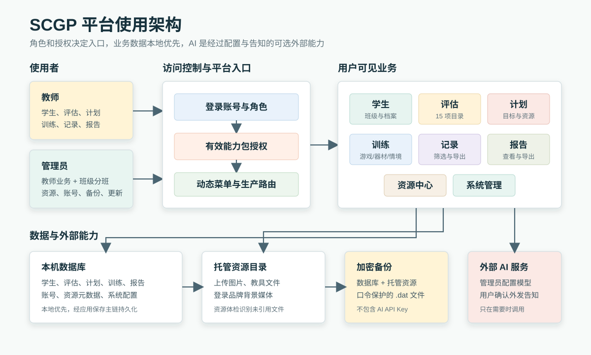
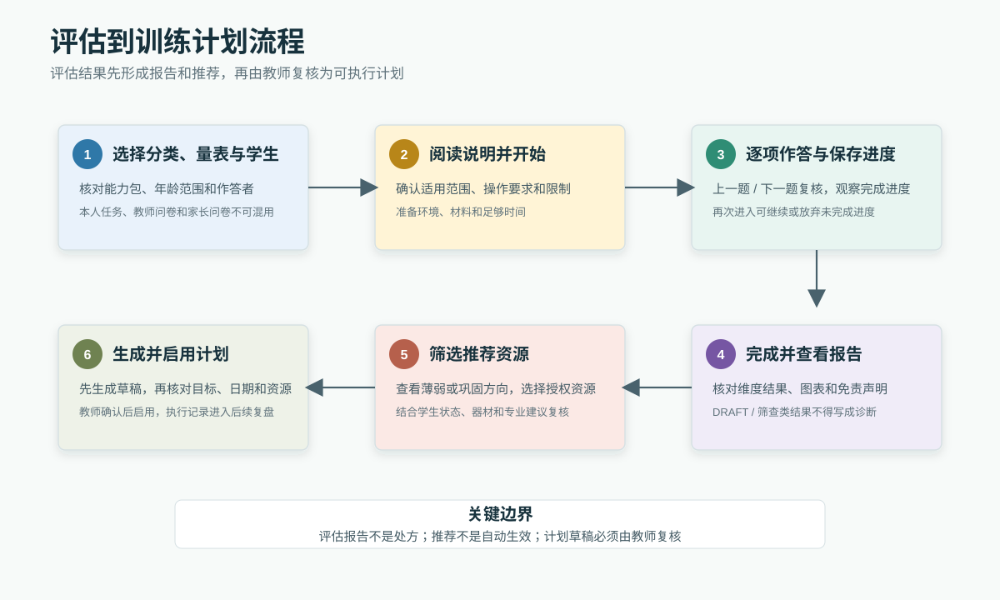
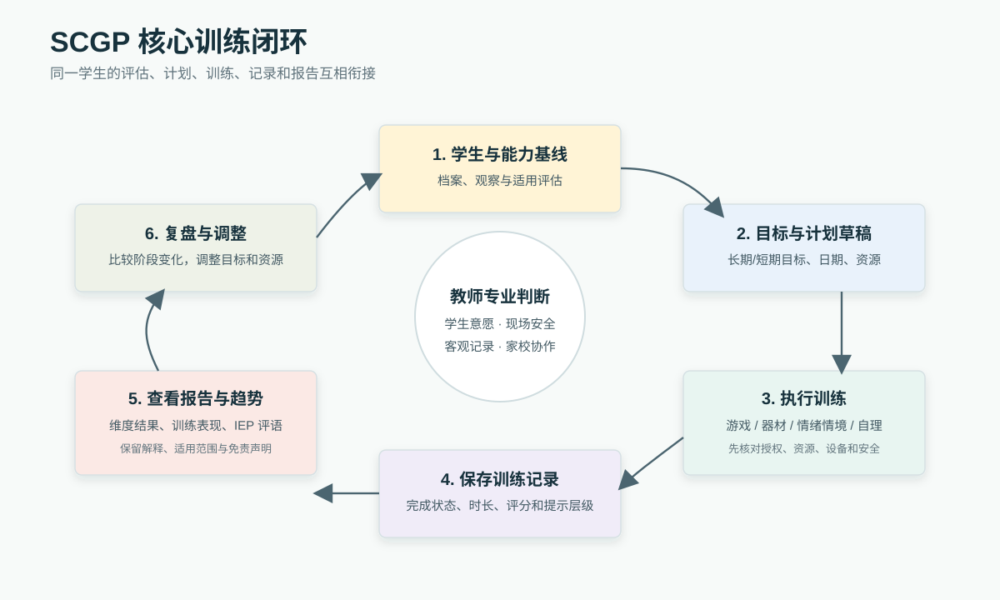
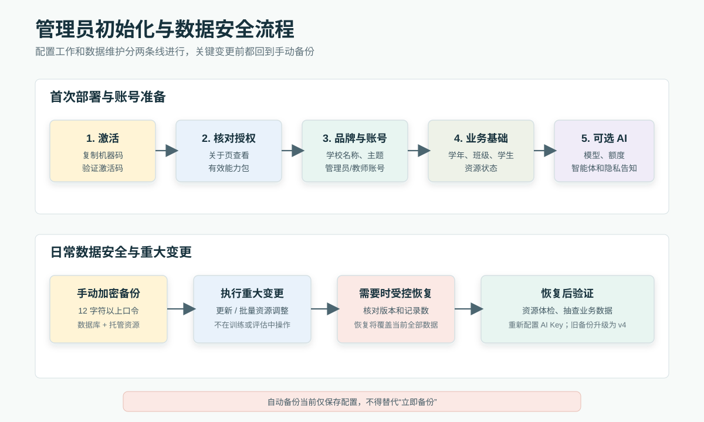

# SCGP / 星愿能力发展平台用户使用手册

**教师与管理员合订本**

文档版本：1.3
编写日期：2026-09-10
适用软件基线：SCGP 1.1.2，代码基线 `1045afc` 及当前工作区已实现功能
编制单位：杭州炫灿科技有限公司

> [文档说明] 本手册以当前代码、生产路由和有效项目文档为准。菜单与功能会随账号角色、授权能力包、资源数据和设备条件变化；未完整交付的规划能力不会写成已可用功能。

## 目录

1. 阅读说明与角色边界
2. 首次使用、激活与登录
3. 界面导航、首页与个人资料
4. 学生管理
5. 班级、学年与学生分班
6. 能力评估
7. 训练计划
8. 情绪行为训练
9. 游戏训练
10. 器材训练
11. 自理训练
12. 训练记录
13. 报告中心与导出
14. 资源中心
15. AI 智能体助手
16. 系统管理
17. 数据安全、日常维护与常见问题
18. 附录

<!-- pagebreak -->

# 1. 阅读说明与角色边界

**适用角色：教师、管理员**

## 1.1 本手册怎样标注功能状态

本手册采用以下状态口径：

| 状态 | 含义 | 使用建议 |
|---|---|---|
| 当前可用 | 当前代码已有完整入口和基本操作闭环 | 可按本手册操作 |
| 条件可用 | 功能已实现，但取决于能力包授权、资源、设备权限、外部文件或 AI 模型配置 | 先确认前置条件 |
| 过渡态 | 页面或配置项可见，但当前没有完整运行闭环，或仅用于兼容旧数据 | 不作为正式业务流程依赖 |

每章标题下都注明适用角色。管理员一般拥有教师业务功能，并额外拥有班级分班、账号、备份、资源维护、AI 配置和系统更新能力。

## 1.2 角色权限总览

| 功能区 | 教师 | 管理员 | 说明 |
|---|---|---|---|
| 首页、学生、评估、计划、训练、记录、报告 | 可用 | 可用 | 具体能力入口受授权能力包控制 |
| 自理任务新建与编辑 | 可用 | 可用 | 当前生产路由对两类角色开放 |
| 班级管理、学生分班 | 不可用 | 可用 | 管理员专属 |
| 资源浏览与教学材料收藏 | 可用 | 可用 | 教师以浏览和使用为主 |
| 训练资源维护、资源包导入导出 | 只读 | 可用 | 管理员可编辑、上下架和维护 |
| 用户、备份、系统设置、AI 配置、授权、更新 | 不可用 | 可用 | 管理员专属 |
| 个人资料、本人 AI 会话 | 可用 | 可用 | 按当前登录账号隔离 |

## 1.3 授权与菜单显示

平台按许可证中的有效能力包决定可见入口。当前业务入口包括：感官统合、情绪调节、社交沟通、精细动作、情绪安抚、生活自理和认知发展。未授权的入口不会出现在评估、游戏、器材或训练记录的选择页中。

如果同事看到的菜单不同，先由管理员在“系统管理 → 关于”核对能力包授权，再核对账号角色。不要仅凭旧许可证字段或历史文档判断权限。

## 1.4 平台使用架构

平台采用本地优先方式运行：学生、评估、训练、计划和系统配置主要保存在本机数据库中，托管图片或文件通过统一资源目录使用；管理员可将数据库和托管资源一起导出为加密备份。AI 是可选外部能力，只有在管理员完成模型服务配置、教师确认外发告知后才会向外部模型服务发送必要内容。

> [图 S001] 管理员登录后的生产环境完整壳层：展开的侧边导航、顶部栏、首页内容区和右下角 AI 浮动入口，不含开发者调试页。

> [图 S002] 教师账号的侧边导航，展示角色和能力包过滤后的入口，用于与管理员视图对照。

# 2. 首次使用、激活与登录

**适用角色：教师、管理员；激活操作通常由管理员或实施人员完成**

## 2.1 首次启动与软件激活

生产环境未激活时会先进入“软件未激活”页面，不能绕过该页面进入登录或业务区。

1. 在“您的机器码”区域点击“复制”。
2. 将机器码提供给软件供应商，获取与当前设备绑定的激活码。
3. 在“输入激活码”中粘贴或输入激活码。
4. 点击“验证激活码”。
5. 激活成功后进入登录页。

激活码与设备绑定，可能是永久或限时授权。更换设备时不要假设原激活码可以直接迁移。已激活系统如需增购能力包，可在“系统管理 → 关于 → 重新激活 / 更新授权”提交新的激活码。

> [图 S003] 软件激活页初始状态：机器码、复制按钮、激活码输入框和验证按钮。

> [图 S004] 激活码校验失败提示，隐藏真实机器码和激活码，用于说明错误处理。

## 2.2 登录

1. 输入用户名和密码。
2. 如需下次自动填入用户名，勾选“记住账号”。该选项只记住用户名，不保存密码。
3. 点击“登录系统”。

用户名或密码错误时，页面会显示错误提示。教师账号无法自行进入用户管理重置密码，应联系管理员；管理员可在“系统管理 → 用户管理”重置账号密码。

当前生产登录页没有“忘记密码”自助流程。开发环境可能出现紧急重置按钮，该按钮不属于生产用户功能，不纳入本手册。

> [图 S005] 登录页正常状态：品牌区、用户名、密码、“记住账号”和登录按钮。

> [图 S006] 用户名或密码错误时的登录页提示状态。

## 2.3 退出登录

点击右上角用户区域，在菜单中选择“退出登录”。在公用设备上结束工作后应主动退出，并妥善保管导出的报告与备份文件。

> [图 S007] 右上角用户菜单及“个人资料”“AI 聊天记录”“退出登录”入口。

# 3. 界面导航、首页与个人资料

**适用角色：教师、管理员**

## 3.1 主界面

左侧导航按四组组织：

- 概览：系统首页。
- 学生与班级：学生管理；管理员还可见班级管理、学生分班。
- 训练与评估：能力评估、训练计划、自理训练、情绪行为、游戏训练、器材训练。
- 记录与系统：训练记录、报告生成、资源中心；管理员还可见系统管理。

菜单按角色和能力包动态过滤。点击左侧折叠按钮可收起导航。系统个别位置可能仍显示历史简称或管理员自定义系统名，本手册统一使用“SCGP / 星愿能力发展平台”。

管理员主界面的完整壳层参见截图 S001；教师导航差异参见截图 S002，本节不再重复使用同一全窗口画面。

## 3.2 系统首页

首页用于快速掌握当天工作并进入常用流程，当前包括：

- 已启用 AI 智能体卡片，可查看支持范围并开始对话。
- 当天训练计划或日程提示，可直接进入对应训练资源。
- 评估焦点、学生与训练等数据概览。
- 手动刷新当前首页数据。

首页显示内容取决于当前账号、已启用 AI 智能体、能力包和是否已有学生或计划数据。没有日程时会显示空状态，不代表数据异常。

> [图 S008] 有业务数据时的系统首页上部：评估焦点、数据指标和已启用 AI 智能体卡片。

> [图 S009] 首页“今日工作”区域，展示当天训练安排和资源启动入口。

> [图 S010] 没有已启用 AI 智能体时的首页空状态。

> [图 S011] 没有当天训练安排时的“今日工作”空状态。

## 3.3 个人资料

从右上角用户菜单进入“个人资料”，可完成：

- 修改姓名和个人头像。
- 从预设头像选择、上传图片或拍照设置头像。
- 修改本账号密码。
- 查看本账号登录日志。
- 进入“AI 聊天记录”查看、继续或删除自己的会话。

头像上传和拍照受文件格式、摄像头和系统权限影响。修改密码后请使用新密码重新登录。

> [图 S012] 个人资料页：基本资料、预设头像、上传和拍照入口。

> [图 S013] 个人资料页的最近 20 条登录日志区域。

> [图 S014] 修改密码区域及密码规则、保存操作。

# 4. 学生管理

**适用角色：教师、管理员**

## 4.1 学生列表与筛选

进入“学生管理”后，可以按姓名或学号搜索，并按性别、诊断信息和班级筛选。页面同时显示学生统计信息。

点击学生行或“查看”进入学生详情。详情页汇总基本信息，并通过标签页查看评估记录、器材训练记录和游戏训练记录。

> [图 S015] 学生管理列表全貌：统计信息、筛选工具栏、学生卡片和主要操作。

> [图 S016] 学生搜索及性别、诊断、班级筛选后的列表状态。

> [图 S017] 学生详情“基本信息”区域。

> [图 S018] 学生详情中的评估、器材训练和游戏训练记录标签。

## 4.2 新增学生

1. 点击“新增学生”。
2. 填写姓名、学号、性别、出生日期等必填信息。
3. 按实际情况补充诊断类型和所属班级。
4. 选择预设头像、上传头像或拍照。
5. 保存后在学生列表中核对结果。

出生日期会影响量表年龄适用判断和部分场景推荐，应准确填写。学生姓名、诊断和联系信息属于敏感信息，只录入完成教育支持所必需的内容。

> [图 S019] “新增学生”表单上半部分：姓名、学号、性别和出生日期等主要字段。

> [图 S020] 学生头像选择器：预设头像、上传图片和拍照入口。

> [图 S021] “新增学生”表单下半部分：诊断类型、所属班级、头像和保存按钮。

## 4.3 编辑与删除

在学生列表或学生详情中可编辑资料。删除学生前应先确认其评估、训练、报告和计划是否仍需保留；删除属于高风险操作，应先完成管理员备份。

> [图 S022] 编辑学生状态，展示已回填资料和保存入口。

> [图 S023] 删除学生前的风险确认提示。

## 4.4 批量导入学生

批量导入支持 `.xlsx` 和 `.xls` 文件，并读取工作簿的第一个工作表。推荐先在学生管理页点击“批量导入”，再点击“下载模板”；模板包含“姓名*、性别*、出生日期*、学号、诊断类型”五列，其中姓名、性别和出生日期为必填项。

导入流程如下：

1. 按模板填写学生数据，保持首行字段名称可识别；空白行会自动忽略。
2. 点击“选择文件”上传 Excel 文件，再点击“开始导入”。
3. 系统逐行校验并写入通过校验的数据，完成后显示成功、失败数量和每一行的处理结果。
4. 对失败行修正后，可重新导入该行；已成功写入的学生无需重复导入。

校验规则：性别只能填写“男”或“女”；出生日期必须是有效日期且不得晚于当天；学号为空时由系统生成，已存在或在同一导入文件中重复的学号会标记为失败。单行校验或写入失败不会阻断其他有效行，导入结果以页面中的逐行状态为准。

> [图 S024] 批量导入学生对话框：展示模板下载、文件选择和“开始导入”入口。

# 5. 班级、学年与学生分班

**适用角色：管理员**

## 5.1 班级管理

“班级管理”用于按学年维护班级。管理员可以：

- 切换或筛选学年。
- 新建班级或批量创建班级。
- 维护学年及当前学年状态。
- 编辑、删除班级。
- 查看班级学生。
- 学生加入、调班和移出应前往“学生分班”完成；班级学生弹窗中的添加、移出按钮当前仅显示开发提示。
- 为班级分配教师。

删除班级前先确认是否仍有关联学生和教师。班级调整后，应在学生详情或分班页面复核。

> [图 S025] 班级管理主界面：学年选择、班级列表和统计信息。

> [图 S026] “新建班级”表单：学年、年级、班号、最大人数和班级名称。

> [图 S027] “批量创建班级”表单：学年、年级范围、每个年级班数和最大人数。

> [图 S028] “编辑班级”回填表单和保存入口。

> [图 S029] 删除班级前的确认提示。

> [图 S030] “学年管理”列表：学年、日期、班级数、学生数和当前状态。

> [图 S031] 新增或编辑学年的表单及“设为当前学年”开关。

> [图 S032] 班级学生列表及添加、移出入口，并在图注中明确当前应转“学生分班”完成变更。

> [图 S033] 为班级分配教师的选择界面。

## 5.2 学生分班

“学生分班”提供两个视图：

- 分班管理：按分班状态、班级和学年筛选，执行单个或批量分班。
- 班级视图：按班级查看学生构成和分班结果。

管理员还可以查看班级历史，并执行学年升级或毕业操作。升级前建议先做完整备份，再核对目标学年；如选择自动创建班级，应在完成后检查新班级名称和学生归属。

> [图 S034] “分班管理”视图：分班状态、学年和班级筛选。

> [图 S035] 单个学生执行分班或调班的对话框。

> [图 S036] 勾选多个学生后的批量分班对话框。

> [图 S037] “班级视图”中的班级和学生构成。

> [图 S038] “学年升级”表单及最高年级学生毕业规则。

> [图 S039] 学生班级变更历史对话框。

# 6. 能力评估

**适用角色：教师、管理员**

## 6.1 评估目录

能力评估页按感官统合、情绪调节、情绪安抚、社交沟通、精细动作、生活自理和认知发展分组，只显示当前能力包可用的量表。

当前代码接入 18 项评估：

| 评估 | 适用年龄 | 题量或项目 | 预计时长 | 当前边界 |
|---|---|---:|---:|---|
| S-M 婴儿-初中生社会生活能力量表 | 6个月-14岁 | 132道 | 30-45分钟 | 当前可用 |
| WeeFIM 改良儿童功能独立性评估量表 | 0-18岁 | 18道 | 15-20分钟 | 当前可用 |
| CSIRS 儿童感觉统合能力发展评定量表 | 3-12岁 | 58道 | 15-20分钟 | 当前可用 |
| Conners 父母用问卷（PSQ） | 3-17岁 | 48道 | 10-15分钟 | 当前可用 |
| Conners 教师用问卷（TRS） | 3-17岁 | 28道 | 5-10分钟 | 当前可用 |
| SDQ 长处和困难问卷（父母版） | 3-16岁 | 25道 | 5-10分钟 | 当前可用 |
| SRS-2 社交反应量表第二版（学龄版） | 6-18岁 | 65道 | 15-20分钟 | 当前可用 |
| CBCL Achenbach 儿童行为量表（家长版） | 4-16岁 | 113道+社会能力 | 20-30分钟 | 当前可用 |
| 儿心量表Ⅱ（CNBS-R2016） | 0-7岁（0-84个月） | 261道 | 30-40分钟 | 超龄时系统阻止使用标准常模 |
| TGMD-3 大肌肉动作发展测验 | 3岁0个月-10岁11个月 | 13项动作 | 15-20分钟 | 当前可用 |
| GMFM-88 粗大运动功能评定量表 | 5个月-16岁 | 88项 | 45-60分钟 | 当前可用 |
| FMDA 小肌肉功能发展评估量表 | 0-6岁 | 88项 | 20-30分钟 | 当前可用 |
| ABC 孤独症行为评定量表 | 3岁以上 | 57道 | 15-20分钟 | 当前可用 |
| ATEC 孤独症治疗评估量表 | 2岁以上 | 77道 | 15-20分钟 | 当前可用；用于疗效追踪，不作诊断依据 |
| PEP-3 心理教育量表（中文修订版） | 2-7岁（常模覆盖 2-7.5 岁） | 139题 | 45-60分钟 | 快照功能上线前的旧记录页会提示重测；派生 DQ 不作官方分数 |
| BRIEF 执行功能评估量表 | 2-18岁 | 学前15道/学龄27道 | 10-15分钟 | 自编题目与占位常模 DRAFT |
| CRT 瑞文图形推理测验 | 5.5-16.5岁 | 60道 | 20-30分钟 | 仅用于筛查和发展监测 |
| 综合认知自测（图形匹配） | 5.5-16.5岁 | 16道正式题+2道练习 | 5-8分钟 | 自编题与常模，非标准化 DRAFT |

> [重要] 所有评估结果都用于教育支持和发展监测，不能替代医学、心理或康复专业诊断。BRIEF 和综合认知自测的报告页面明确标为 DRAFT；CRT 仅用于筛查和发展监测；ATEC 用于干预效果追踪，不用于孤独症诊断；PEP-3 的发育商为系统派生参考值，不是官方常模分数。使用这些结果时必须保留页面中的限制说明。

> [图 S040] 能力评估页的分类导航和当前分类量表卡片；页面一次只展示当前分类结果。

> [图 S041] 选择一个能力分类后的量表过滤结果，保留年龄和预计时长信息。

## 6.2 开始评估

1. 选择评估分类和量表。
2. 选择学生。
3. 阅读欢迎页的适用说明、作答者和操作提示。
4. 点击开始，按题目或操作项目逐项记录。
5. 使用“上一题”“下一题”核对答案，观察顶部进度。
6. 完成后确认提交，查看完成提示和报告入口。

不同量表可能由教师、家长代答，或由学生本人完成图形任务。开始前应根据量表名称和欢迎说明确认作答者，不要代替学生完成需要本人操作的任务。

> [图 S042] 开始评估前的学生选择页。

> [图 S043] 为超龄学生选择儿心量表Ⅱ时的阻断提示。

> [图 S044] 评估欢迎说明：量表说明、专业或家长提示、限制提醒和开始按钮；具体字段以所选量表实际页面为准。

> [图 S045] 标准问卷答题页：题目、选项、上一题、下一题和进度。

> [图 S046] 儿心量表Ⅱ操作项目评分界面：操作方法、通过要求和“通过 / 不通过”控件。

> [图 S047] TGMD-3 动作项目评分界面：动作标准和技能评分控件。

> [图 S048] CRT 图形推理题界面；筛查限制提示在欢迎页或报告页另行保留。

> [图 S049] 综合认知自测的图形匹配题界面，并保留 DRAFT 标识。

> [图 S050] CBCL 社会能力表单未完成必填项时的校验状态。

## 6.3 自动保存、恢复与重新开始

答题过程中，系统会在已有答案后静默保存当前进度，页面没有单独的“已保存”标识。再次进入同一学生、同一量表时，如检测到未完成进度，会提示继续评估或重新开始。

- 继续评估：从保存的位置恢复。
- 重新开始：直接清除本次未完成进度并回到欢迎页，当前没有二次确认框。

评估过程中仍应避免直接关闭应用。长量表建议分段完成，并在离开前确认页面没有报错。

系统会随评估记录客观保存总用时和平均每题用时，并在报告页“评估用时”区域展示；部分儿童自答类测验（瑞文图形推理、综合认知自测）还会在作答模式疑似随机时附加“疑似随机作答”内部标记。用时与标记只供教师和管理员结合施测情境参考，不会阻断提交，也不构成对评估有效性的自动判定。

> [图 S051] 再次进入时的“继续评估 / 重新开始”选择提示。

## 6.4 完成后的推荐与计划草稿

评估完成后，可从完成窗口查看报告。部分评估还会打开能力巩固或器材推荐抽屉：

1. 查看薄弱能力或巩固方向。
2. 浏览当前能力包允许使用的器材或资源。
3. 勾选适合的项目。
4. 生成训练计划草稿。
5. 进入训练计划核对日期、目标和资源安排，再决定是否启用。

推荐结果是计划草稿的输入，不等于自动生效的训练处方。教师应结合学生状态、专业建议、场地和器材安全复核。

> [图 S052] 评估提交完成窗口：查看报告和后续操作入口。

> [图 S053] 能力巩固或器材推荐抽屉：薄弱领域、推荐资源勾选状态和“生成训练计划草稿”按钮。

> [图 S054] 生成推荐后手动进入“训练计划”定位到的计划草稿，展示待复核字段；不要依赖当前失效的自动跳转。

## 6.5 查看评估报告

报告可从评估完成页、学生详情的评估记录或“报告生成”进入。报告页通常包含学生信息、得分或维度结果、图表、解释与免责声明；18 项量表的报告页均提供“导出 Word”。PEP-3 报告页会显示报告快照状态：旧版记录由明细表只读重算展示并提示重测，属预期行为，重测后即可生成含完整建议的快照报告。

不要只截取单个总分转发。对外沟通时应同时保留量表名称、评估日期、适用范围、解释和免责声明。

> [图 S055] 学生详情“评估记录”中的报告入口。

> [图 S056] S-M 社会生活能力量表报告上部：总分、等级和解释。

> [图 S057] S-M 报告下部：雷达图和维度结果表。

> [图 S058] WeeFIM 报告上部：总体结果和独立性等级。

> [图 S059] WeeFIM 报告下部：各领域结果明细。

> [图 S060] CSIRS 感觉统合评估报告上部：总体结果和解释。

> [图 S061] CSIRS 报告下部：雷达图和维度详情。

> [图 S062] Conners PSQ 报告上部：质量检查和结果总览。

> [图 S063] Conners PSQ 报告下部：雷达图和因子详情。

> [图 S064] Conners TRS 报告上部：质量检查和结果总览。

> [图 S065] Conners TRS 报告下部：雷达图和因子详情。

> [图 S066] SDQ 报告上部：总困难分和亲社会行为结果。

> [图 S067] SDQ 报告下部：分量表结果详情。

> [图 S068] SRS-2 报告上部：总分和总体解释。

> [图 S069] SRS-2 报告下部：维度表和免责声明。

> [图 S070] CBCL 报告上部：免责声明和社会能力结果。

> [图 S071] CBCL 报告下部：行为剖面图和因子表。

> [图 S072] 儿心量表Ⅱ报告上部：CA、MA、DQ 和年龄适用提示。

> [图 S073] 儿心量表Ⅱ报告下部：五个能区结果。

> [图 S074] TGMD-3 报告上部：总体结果和分测验结果。

> [图 S075] TGMD-3 报告下部：13 项动作技能结果。

> [图 S076] GMFM-88 报告上部：总体结果。

> [图 S077] GMFM-88 报告下部：五大能区结果；当前报告没有图表。

> [图 S078] FMDA 报告上部：总体结果和领域雷达图。

> [图 S079] FMDA 报告下部：六领域解读和 IEP 目标；当前没有逐项目结果表。

> [图 S080] CPEP-3 报告上部：快照标签、总体结果和雷达图。

> [图 S081] CPEP-3 报告重测提示与只读重算说明。

> [图 S082] BRIEF 执行功能报告，必须完整保留 DRAFT 常模提示。

> [图 S083] CRT 瑞文图形推理测验结果主体和五组结果。

> [图 S084] CRT 报告末尾的“仅用于筛查和发展监测”免责声明。

> [图 S085] 综合认知自测结果页，完整保留自编占位题与常模 DRAFT 提示。

# 7. 训练计划

**适用角色：教师、管理员**

## 7.1 计划列表

训练计划页支持按状态、归属模块、学生和计划名称筛选。常见状态包括草稿和已启用；页面也会区分由评估推荐生成的计划。

> [图 S086] 训练计划列表全貌：统计、筛选工具栏和计划卡片；当前没有表格视图。

> [图 S087] 按状态、归属模块、学生和计划名称筛选后的计划卡片。

## 7.2 新建或编辑计划

计划编辑器按步骤组织：

1. 基本信息：计划名称、能力入口、学生、起止日期和说明。
2. 训练目标：填写长期目标和短期目标。
3. 资源安排：添加游戏、器材或其他训练资源，设置频次、时长和备注。
4. 保存：先保存为草稿并复核。

计划日期应覆盖实际执行周期。资源安排需与学生目标相符，并确认当前能力包、资源状态和设备条件可用。

> [图 S088] 新建计划“基本信息”步骤：名称、学生、能力入口和日期。

> [图 S089] 计划编辑器“训练目标”步骤：长期目标和短期目标。

> [图 S090] “选择训练资源”对话框：模块、资源类型、关键词和多选结果。

> [图 S091] 计划编辑器“资源编排”标签：已选资源、频次、时长和教学提示。

> [图 S092] 保存后的计划草稿详情抽屉；该抽屉当前不含编辑按钮。

> [图 S093] 计划卡片操作菜单中的“编辑”入口。

## 7.3 启用、执行与回顾

草稿复核后可启用。首页会根据日期提示当天安排；实际资源启动入口位于执行中计划卡片的“今日训练推荐”。执行后，记录会进入训练记录或相应模块报告。

删除计划不会代替删除已经形成的评估和训练记录。计划发生重大调整时，建议在说明或备注中保留原因。

> [图 S094] 草稿计划启用前的确认状态或启用操作。

> [图 S095] 执行中计划卡片的“今日训练推荐”和资源启动入口。

# 8. 情绪行为训练

**适用角色：教师、管理员；需要相关能力包和有效情境资源**

## 8.1 训练方向

“情绪行为”当前提供两条训练链：

- 情绪与场景：通过生活场景识别情绪、观察线索、推理原因并选择回应方式。
- 表达关心：在具体情境中练习共情和关心表达，理解不同话语对他人的影响。

> [图 S096] 情绪行为首页的“情绪与场景”和“表达关心”训练方向。

## 8.2 开始情境训练

1. 选择训练方向。
2. 如尚未指定学生，系统先进入学生选择页。
3. 在情境选择页按年龄、场域、主题、目标情绪或关心方式筛选。
4. 点击情境卡片进入沉浸式训练。
5. 按屏幕步骤引导学生观察、作答和复盘。
6. 完成后进入当前训练结果页，可返回训练菜单或再练一次；进步报告从模块入口另行查看。

情境选择页的数据来自当前启用的资源。没有可选情境时，教师可联系管理员前往资源中心检查资源状态。

> [图 S097] 情绪训练开始前的学生选择页。

> [图 S098] “情绪与场景”选择页的年龄、空间和主题筛选。

> [图 S099] “表达关心”选择页的年龄、接收者情绪和关心方式筛选。

> [图 S100] 筛选后的情境卡片及开始入口。

> [图 S101] 沉浸式情绪训练主画面：场景、问题和作答区域。

> [图 S102] 沉浸式训练中的荧光笔圈画模式和画面标记工具。

> [图 S103] 教师干预控制台：当前训练提示和流程控制。

> [图 S104] 当前沉浸式训练结果页：星级、保存状态、返回和“再练一次”入口。

## 8.3 情绪模块报告

情绪模块报告按学生汇总训练总次数、平均正确率、平均提示层级、正确率趋势、情绪表现、关心偏好和场景掌握情况，并提供教师或家长干预建议。报告页支持导出 Word。

建议只有在学生已有情绪训练记录后再生成报告；空数据不应解释为能力结论。

> [图 S105] 情绪模块进步报告上部：摘要、趋势和 Word 导出入口。

> [图 S106] 情绪模块进步报告下部：偏好、场景掌握和干预建议。

# 9. 游戏训练

**适用角色：教师、管理员；需要相应能力包、游戏资源和设备权限**

## 9.1 进入游戏训练

标准路径为：

1. 在“游戏训练”选择能力入口。
2. 选择学生。
3. 在游戏大厅选择游戏。
4. 根据所选游戏的实际设置页配置难度、时长或模式；经典感官游戏和注册表游戏的设置界面不同。
5. 需要设备权限时先通过权限门禁，再开始沉浸式训练。
6. 正常完成或由教师结束，系统保存对应状态和训练记录。

> [图 S107] 游戏训练的能力入口选择页，展示授权过滤后的能力卡片。

> [图 S108] 游戏训练开始前的学生选择页。

> [图 S109] 游戏大厅：当前资源和授权允许显示的游戏卡片。

> [图 S110] 一项经典感官游戏开始前的难度、时长或模式设置。

> [图 S111] 一项注册表游戏开始前的难度设置。

## 9.2 当前游戏范围

当前代码目录包含感官统合基础游戏 11 个，以及跨情绪调节、精细动作、社交沟通、情绪安抚、生活自理、认知发展的自定义游戏 31 个。实际页面显示数量取决于数据库资源、启用状态和能力包，不应把代码目录数量等同于每个安装环境的可用数量。

部分代表性游戏包括：颜色配对、形状识别、视觉追踪、声音辨别、节奏模仿、空气木琴、打泡泡、深呼吸热气球、音量魔法森林、表情侦探、合作造汉堡、云朵擦擦擦、吹蒲公英、洗手小能手、记忆翻牌和图形找规律。

## 9.3 摄像头、麦克风和双人游戏

部分游戏需要摄像头、麦克风或两名学生共同参与：

- 摄像头或麦克风游戏会先进行权限检测。
- 权限被拒绝时，按页面提示打开操作系统设置后重新检测。
- 当前统一游戏容器没有接通通用的鼠标或触控降级入口，不要根据注册表中的降级元数据推断页面一定可绕过权限。
- 双人游戏应在游戏开始前确认两名学生信息和参与意愿。

教师提前结束时，记录可能标记为“已中断 / teacher_exit”，不要把中断记录当作完整训练成绩。

> [图 S112] 摄像头权限被系统阻止时的门禁卡、打开系统设置和重新检测入口；当前没有摄像头预览画面。

> [图 S113] 麦克风权限被阻止时的门禁卡和重新检测入口；当前没有音量检测器。

> [图 S114] 双人游戏的两名学生确认和参与设置。

> [图 S115] 一项代表性游戏的沉浸式运行画面，隐藏无关导航。

> [图 S116] 游戏正常完成后的结果状态。

> [图 S117] 选择“教师结束本局”后的确认提示。

> [图 S118] 教师结束后在训练记录中形成的“已中断”状态；当前没有统一的中断结果页。

## 9.4 训练记录与 IEP 报告

游戏完成后可在训练记录查看时长、完成状态、正确率或游戏特定指标。部分游戏完成后会生成 IEP 训练报告；报告页可按当前页面提供的按钮导出 Word，部分页面也提供 PDF/打印方式。

> [图 S119] 自定义小游戏训练记录详情。

> [图 S120] 符合条件游戏生成的 IEP 报告及导出入口。

# 10. 器材训练

**适用角色：教师、管理员；需要相应能力包和可用器材资源**

## 10.1 快速录入流程

1. 进入“器材训练”，选择能力入口。
2. 选择学生。
3. 从资源选择器选择器材。
4. 填写训练评分（1-5 分）。
5. 选择辅助等级：独立完成、口头提示、视觉提示、手触引导或身体辅助。
6. 填写训练时长和备注。
7. 点击“保存记录”或“保存并继续”。

评分和辅助等级要以本次可观察表现为依据。备注建议记录任务、学生反应、教师提示和调整策略，不写医学诊断结论。

> [图 S121] 器材训练入口菜单及授权允许显示的入口卡片。

> [图 S122] 选择器材训练入口后的学生选择页。

> [图 S123] 按能力入口过滤后的器材列表与器材详情。

> [图 S124] 器材快速录入表单：评分、辅助等级、时长和备注；日期由提交时自动生成。

> [图 S125] 器材训练记录提交成功后的反馈状态。

## 10.2 安全边界

器材推荐只表示资源标签与训练目标之间的匹配，不等于医学许可或康复处方。活动前应核对实物型号、完整性、承重、说明书、场地保护和学生意愿。出现疼痛、急性不适、明显拒绝或设备异常时应立即停止，并按学校流程联系主管教师、校医或专业人员。

## 10.3 记录与 IEP 评语

器材记录页可按学生、入口、分类和日期筛选，查看详情、删除记录，并生成或导出 IEP 训练评语。删除前应确认记录是否已用于阶段总结或报告。

> [图 S126] 器材训练记录卡片及查看评语、删除等操作。

> [图 S127] 器材 IEP 训练评语弹窗及导出入口。

> [图 S128] 删除器材训练记录前的确认提示。

# 11. 自理训练

**适用角色：教师、管理员；需要生活自理能力包**

## 11.1 自理任务列表

自理训练以任务和步骤组织。任务列表可按分类筛选，点击任务后选择学生并进入执行页。教师和管理员当前都可新建、编辑任务。

> [图 S129] 自理任务列表全貌：分类、任务卡片和新建入口。

> [图 S130] 按分类筛选后的自理任务列表；当前没有关键词搜索。

## 11.2 新建或编辑任务

任务应包含清晰名称、分类、说明和有顺序的步骤。每个步骤可配置文字和媒体。建议将复杂活动拆成学生可以观察和完成的小步骤，并使用一致的动作描述。

计划入口与自理任务之间仍有少量过渡性启动上下文，不应依赖占位提示判断计划已完成。正式执行以从任务卡片选择学生后进入执行页为准。

> [图 S131] 新建自理任务的资源基础信息：名称、分类、描述、封面路径和能力标签。

> [图 S132] 自理任务编辑器中的结构化分类和能力项元数据；当前没有“适用对象”字段。

> [图 S133] 自理任务步骤编排：步骤说明及图片、视频、音频路径；当前没有独立提示字段或拖动排序。

> [图 S134] 编辑已有自理任务时的内容回填和“保存修改”按钮。

## 11.3 执行与记录

执行页逐步记录：

- 完成水平：独立、提示、协助、不能完成。
- 错误等级：0-3 级。
- 教师观察备注。

教师可在步骤间前后移动。完成全部步骤后保存为完成记录；中途结束时按页面流程保存为中断记录。保存后系统直接跳转到对应训练记录列表，当前没有独立完成总结页。

> [图 S135] 带任务名称的学生选择页；当前没有独立的任务确认步骤。

> [图 S136] 自理任务执行页：当前步骤、提示、完成水平、错误等级和教师备注。

> [图 S137] 自理任务最后一步和“完成训练”按钮。

> [图 S138] 保存成功后跳转到训练记录页的状态和成功提示；当前没有独立完成总结页。

# 12. 训练记录

**适用角色：教师、管理员**

## 12.1 选择入口与记录类型

进入“训练记录”后先选择能力入口，再在以下标签间切换：

- 游戏训练记录。
- 器材训练记录。

生活自理任务记录会并入相应训练记录链；当前“查看详情”会回到任务执行路由，不是只读的历史总结页。情绪自定义小游戏会打开专用详情页。

> [图 S139] 训练记录的能力入口选择页。

> [图 S140] “游戏训练记录”标签及主要字段。

> [图 S141] “器材训练记录”标签及主要字段。

## 12.2 筛选、查看与导出

记录面板支持按学生、日期快捷范围和其他条件筛选，并可刷新、查看详情或导出 Excel。器材记录还可按分类筛选。

导出前先核对当前能力入口、学生和日期范围，避免把不相关记录混入同一文件。导出的 Excel 和报告包含学生信息，应存放在学校批准的位置。

> [图 S142] 游戏训练记录按学生和日期筛选后的结果，保留“查看详情”和“导出 Excel”入口。

> [图 S143] 器材训练记录按学生、分类和日期筛选后的结果，保留“查看详情”和“导出 Excel”入口。

## 12.3 删除记录边界

统一训练记录页当前没有通用删除操作。器材记录可在器材训练记录页删除，流程和确认框见 10.3；其他记录是否可删除以具体详情页实际按钮为准。删除训练记录属于不可逆业务操作，重要阶段数据建议由管理员先备份。

# 13. 报告中心与导出

**适用角色：教师、管理员**

## 13.1 查找报告

报告中心可按学生、报告类型、日期范围和快捷时间筛选，并显示评估、情绪、IEP 和训练相关报告。常用操作包括查看和删除。

页面上的“下载”操作会先打开对应报告页；评估报告页均提供“导出 Word”，情绪、IEP 与部分训练报告的导出方式以报告页按钮为准，不是报告中心统一直接下载。

> [图 S144] 报告中心全貌：报告类型、学生、日期筛选和列表。

> [图 S145] 应用学生、报告类型和日期条件后的筛选结果。

> [图 S146] 报告表格行中的“查看”“下载”“删除”操作；“下载”实际先打开具体报告页。

> [图 S147] 删除报告前的确认提示。

## 13.2 当前 Word 导出范围

当前 18 项评估量表的报告页均提供“导出 Word”；其中 15 项报告页另提供“AI 解读”按钮（CSIRS、Conners PSQ、Conners TRS 暂无，后续版本补齐）。

- 以下 15 项的导出文件不附带特殊声明：ABC、ATEC、CBCL、Conners PSQ、Conners TRS、CSIRS、儿心量表Ⅱ、FMDA、GMFM-88、PEP-3、S-M、SDQ、SRS-2、TGMD-3、WeeFIM。
- BRIEF、CRT、综合认知自测的报告页同样可导出，但导出文件会附带各自的 DRAFT 或筛查定位声明。
- PEP-3 旧版记录的导出内容为只读重算层，重测后导出完整快照报告。

情绪模块报告支持 Word 导出；部分游戏 IEP 报告也支持 Word。报告页顶部有“AI 解读”按钮的，点击后会打开 AI 助手并给出解读引导问题；AI 生成的解读内容不会自动写入导出的 Word 文件。

> [图 S148] 支持 Word 的代表性评估报告及“导出 Word”入口。

> [图 S149] 情绪模块报告及其 Word 导出入口。

## 13.3 报告使用原则

- 报告用于教育支持、目标制定和阶段复盘。
- 保留评估日期、量表版本、作答者、适用年龄和免责声明。
- 不把 AI 建议、筛查结果或单次训练表现写成医学诊断。
- 对外分享前删除非必要身份信息，并遵循学校审批与家校沟通流程。

# 14. 资源中心

**适用角色：教师、管理员；维护操作仅管理员**

## 14.1 训练资源

训练资源标签页用于搜索和筛选游戏、器材、情绪情境等统一资源。可按业务入口、资源类型、状态和关键词查找，并在列表中查看封面、说明和标签；当前没有独立训练资源详情页。

教师为只读使用；管理员可以：

- 新建和编辑自定义资源的基本信息、说明和标签。
- 启用或停用资源。
- 软删除并恢复自定义资源。
- 导入或导出情绪资源包。
- 编辑系统预设资源的说明和标签。

系统预设资源的名称和分类受保护，不能像自定义资源一样删除。资源状态会直接影响训练选择页是否可见。

> [图 S150] 教师账号下的“训练资源”只读列表，展示与管理员维护态的角色差异。

> [图 S151] 按业务入口、类型、状态和关键词筛选训练资源。

> [图 S152] 器材封面预览及列表中的说明和标签；不要虚构独立详情页。

> [图 S153] 管理员新建自定义训练资源的表单。

> [图 S154] 编辑系统预置资源时名称、类型等受保护字段的锁定状态；当前“更换封面”按钮未接文件处理，不作为已交付步骤。

> [图 S155] 情绪资源包导入预览：文件校验、冲突和待导入内容。

> [图 S156] 情绪资源包导出预览和导出范围。

> [图 S157] 管理员在训练资源列表中执行启用或停用的状态开关。

> [图 S158] 软删除自定义训练资源前的确认提示。

> [图 S159] 筛选已禁用或已删除资源后的结果及恢复入口。

## 14.2 教学材料与收藏

教学材料标签页支持按维度和文件类型筛选、打开材料、加入收藏，并在“我的收藏”查看。管理员还可以：

- 选择教学材料来源目录。
- 下载 CSV 模板。
- 上传和批量导入材料元数据。
- 维护不再使用的材料。

教学材料的 PDF 或 Office 文件在 Electron 中通常调用系统默认程序打开。文件不存在、路径无效或本机没有合适程序时可能无法打开。

> [图 S160] 教学材料列表及维度、文件类型筛选。

> [图 S161] 教学材料卡片中的打开、详情、收藏入口和已收藏标识；不采集系统默认程序打开后的外部窗口。

> [图 S162] 教学材料详情弹窗。

> [图 S163] “我的收藏”视图和取消收藏操作。

> [图 S164] 管理员教学材料工具栏、来源目录和 CSV 模板入口。

> [图 S165] 单个教学材料上传表单。

> [图 S166] 教学材料批量导入表单和文件选择状态。

> [图 S167] 教学材料导入完成后的结果提示和列表变化。

## 14.3 当前资源边界

- 收藏功能当前只在教学材料标签形成可用界面；训练资源标签尚未接入收藏操作。
- 预置教学视频当前有 389 条元数据，但视频文件并未全部随应用打包。能否播放取决于管理员配置的来源目录和实际文件是否存在。
- 资源图片或文件缺失时，管理员应先使用“系统管理 → 数据备份 → 资源文件体检”核对，不要直接改数据库路径。

# 15. AI 智能体助手

**适用角色：教师、管理员；管理员负责配置，所有用户需确认外发告知**

## 15.1 使用前提

AI 为条件可用功能，需同时满足：

- 管理员已配置并启用至少一个模型服务和模型。
- AI 总开关开启，服务未因额度策略被阻止。
- 至少一个智能体已向教师启用。
- 当前设备可以访问所配置的外部模型服务。

教师看到“尚未配置模型服务 API Key”时，应联系管理员。教师账号不能进入系统管理自行配置。

## 15.2 内置智能体

当前工作区包含 6 个内置智能体：

| 名称 | 显示角色 | 主要用途 |
|---|---|---|
| 一人一策 | 个别化教学专家 | 个别化目标、课堂调整、资源教室训练 |
| 沟通有方 | 课堂沟通支持专家 | 理解、表达、视觉沟通和课堂参与 |
| 成长看得见 | 成长观察助手 | 客观观察、变化追踪和协作转介 |
| 家校好好说 | 家校沟通助手 | 微信、电话和面谈草稿 |
| 心晴陪伴 | 情绪支持助手 | 情绪稳定、同伴冲突和校内协作 |
| 稳健训练 | 康复训练支持专家 | 器材安全、低风险活动适配、记录与转介 |

管理员可以启用或停用内置智能体，也可创建自定义智能体并挂载知识技能。不同智能体可用的工具和“生成报告”能力不同。

## 15.3 开始和管理会话

可以从首页智能体卡片或右下角浮动按钮打开 AI 助手：

1. 选择智能体和当前模型；在输入框上方还可选择本次对话关联的学生（可不选；未开始对话时先选学生，发送第一条消息时会自动建立对话）。
2. 点击开场问题，或输入自己的问题：输入 `/` 会弹出当前智能体的快捷模板（如 `/报告`、`/开场N`），↑↓ 选择、Enter 插入后仍可编辑再发送。
3. 需要时添加附件：点击“附件”按钮，或直接把图片/文档拖入输入框、粘贴截图（当前模型支持图片时）。
4. 核对即将发送的内容并发送（输入框随内容自动增高；发送期间可继续输入，点击圆形"停止"按钮可中止当前回答，已生成的部分内容会保留）。
5. 在回答下继续追问、编辑最近消息，或将单条回答导出为 Word。

抽屉显示最近最多 6 条会话；点击“查看全部历史”进入当前账号的完整会话列表，可继续或删除会话。

> [图 S168] 登录后的右下角 AI 圆形浮动入口及悬停提示。

> [图 S169] AI 助手抽屉全貌：智能体、最近会话、消息区和输入区。

> [图 S170] AI 抽屉中的智能体选择器展开状态。

> [图 S171] “模型与设置”浮层及模型选择器展开状态。

> [图 S172] 开场问题、文本输入、发送按钮及“回答仅供参考”提示。

> [图 S173] AI 抽屉中的最近 6 条会话和删除入口。

> [图 S174] “AI 聊天记录”完整历史页面中的继续和删除操作。

## 15.4 附件与报告

附件入口当前接受图片、PDF、DOCX 和 XLSX：

- 图片只有在当前模型支持视觉时才会发送。
- PDF、Word 和 Excel 会先抽取文本，再随问题发送。
- 不支持的文件会被跳过并提示。
- 带 `generate_report` 工具的智能体可使用“生成报告（导出 Word）”。
- 对已完成的助手回答，可点击“导出 Word”，不需要再次请求模型重写。

上传前先删除与当前问题无关的学生身份、联系方式和健康信息。不要上传未经学校批准的整份档案。

> [图 S175] 附件按钮及选择图片、PDF、DOCX 或 XLSX 后的待发送预览；当前没有应用内附件菜单，不显示真实磁盘路径。

> [图 S176] 学生详情“AI 记忆”卡片的待确认候选与确认/拒绝操作。

> [图 S177] 已确认记忆列表与置顶、标记关键操作。

## 15.5 AI 学生长期记忆

在对话中绑定了学生的前提下，系统会自动提炼对话中的关键信息，生成“待确认记忆”候选（如学生的兴趣、有效的干预方式、家庭备注等），供教师确认后沉淀为该学生的长期记忆；确认过的记忆会在后续对话中自动参考，帮助 AI 延续对这名学生的了解。

使用与边界：

- 只有该学生的服务团队教师和管理员能看到并确认记忆；其他教师不可见。
- 对话发送前，系统会自动脱敏学生姓名等敏感信息后再提炼；提炼失败不影响正常对话。
- 记忆在学生详情左侧“AI 记忆”卡片中确认：可确认、拒绝、置顶、标记关键或删除；确认不可撤销，只能删除。
- 长期不确认的候选会自动过期，记忆总量按分类设上限，关键记忆受保护。
- 管理员可在系统设置中整体关闭学生长期记忆（见 15.8）。

## 15.6 AI 外发隐私告知

每个账号首次发送前会看到“AI 外发隐私告知”。确认后，以下内容可能上传到外部模型服务：

- 输入的文本。
- 支持视觉时上传的图片。
- PDF、Word、Excel 抽取出的文本。
- 当前智能体挂载的专业知识技能。
- AI 工具为完成请求读取的学生、评估、训练和资源数据。

取消告知会停止本次发送。管理员可重置全体用户的确认状态，使每位用户下次发送时重新确认。

> [图 S178] AI 外发隐私告知窗口，完整显示发送范围、确认和取消入口。

## 15.7 安全与责任边界

AI 回答仅供参考，不能替代正式评估、诊断、治疗、学校决策或危机处置。遇到自伤自杀表达、虐待线索、严重伤害风险或急性异常，应立即确保现场安全并启动学校既有危机与属地紧急流程，不等待 AI 建议。

> [图 S179] 最近用户消息的“编辑”入口和已完成助手回答的单条“导出 Word”入口。

> [图 S180] 编辑消息时的提示、取消编辑和“保存并重新生成”状态；继续追问仍使用普通输入框。

> [图 S181] 带报告能力的智能体在输入区工具列中的“生成报告”入口。

> [图 S182] 报告工具执行完成后的助手回答和 Word 导出结果提示。

## 15.8 管理员 AI 配置

管理员在“系统管理 → AI 智能体”中可以：

- 配置模型服务、API Key、Base URL 和默认模型。
- 管理模型能力，如视觉、工具调用和思考能力。
- 启停模型服务与 AI 总开关。
- 设置每月 Token 额度和超额阻断。
- 测试连接、管理 Key 归属说明与轮换信息。
- 启停内置智能体，创建或删除自定义智能体，挂载知识技能。
- 重置 AI 外发隐私告知确认。
- 在“业务与合规”卡开启或关闭学生长期记忆（默认开启；关闭后不再自动提炼记忆，已确认记忆保留）。

管理员可在“系统管理 → AI 会话记录”查看全部账号的 AI 对话会话，支持按标题或用户名搜索、分页浏览、查看会话消息与删除会话。

API Key 明文只通过 Electron 主进程安全存储处理，数据库保存密文。完整业务备份会主动排除模型服务 API Key；恢复后必须重新配置。

> [图 S183] 管理员模型服务基础配置：服务、API Key、Base URL、默认模型和模型清单。

> [图 S184] 模型清单、模型能力和新增或编辑模型弹窗。

> [图 S185] 全局用量与风控：AI 总开关、每月额度、超额阻断和用量进度；连接测试位于 API Key 输入框旁。

> [图 S186] 管理员智能体网格、新增入口和启停操作。

> [图 S187] 自定义智能体编辑弹窗和知识技能选择。

> [图 S188] 智能体知识引用资料和系统提示词配置区。

> [图 S189] AI 会话记录列表：标题或用户名搜索、分页和会话消息预览。

> [图 S190] “业务与合规”卡的学生长期记忆开关与外发告知重置入口。

# 16. 系统管理

**适用角色：管理员**

系统管理生产页面包含“用户管理”“数据备份”“系统设置”“AI 智能体”“AI 会话记录”和“关于”。开发环境可能多出“开发者调试”，该页不属于生产功能，禁止写入常规操作流程。

## 16.1 用户管理

管理员可在新建账号时设置用户名、姓名、角色、邮箱和初始密码。编辑账号时用户名不可修改，可更新姓名、角色和邮箱；还可重置密码、启用或停用账号，并删除允许删除的非保护账号。新密码至少 6 个字符。

默认管理员账号受保护，部分停用或删除操作不可用。停用教师账号前应确认其工作已交接；会话、记录和数据归属应按学校制度处理。

> [图 S191] 用户管理列表：用户名、姓名、角色、状态和操作菜单。

> [图 S192] 新建用户表单及用户名、姓名、角色、邮箱和初始密码。

> [图 S193] 编辑账号时的资料回填表单和不可修改的用户名字段。

> [图 S194] “重置密码”对话框。

> [图 S195] 用户操作菜单中的启用或停用、删除入口。

> [图 S196] 删除用户前的风险确认提示。

## 16.2 手动备份

当前可靠的备份方式是“数据备份 → 立即备份”：

1. 点击“立即备份”。
2. 输入不少于 12 个字符的备份口令。
3. 再次输入相同口令。
4. 将下载的 `.dat` 文件保存到学校批准的安全位置。
5. 单独记录口令；遗失口令后无法正常恢复加密备份。

v4 备份会动态覆盖当前数据库全部业务表，并打包本地托管资源文件。备份不包含 AI 模型服务 API Key。

> [图 S197] 数据备份主界面：立即备份、恢复入口和备份内容说明。

> [图 S198] 创建备份时第一次设置口令的单输入框。

> [图 S199] 顺序出现的第二次确认备份口令输入框。

## 16.3 恢复数据

恢复会覆盖当前全部数据，属于高风险操作：

1. 先对当前状态再做一次备份。
2. 点击“选择备份文件”，选择 `.dat` 文件。
3. 输入备份口令，检查备份版本、记录数、表数量和系统信息。
4. 确认来源、版本和口令无误后，点击“恢复数据”。
5. 查看数据库和资源文件恢复结果。
6. 如为旧版备份，恢复后立即重新导出 v4 口令备份。
7. 重新配置 AI 模型服务 API Key。
8. 运行资源文件体检，并抽查学生、评估、计划、训练记录和报告。

不要在正在录入评估或训练记录时恢复。恢复失败或资源仅部分恢复时，保留原备份文件和错误提示，停止继续写入并联系维护人员。

> [图 S200] 选择 `.dat` 后的备份版本、记录数、表数量和系统信息校验结果。

> [图 S201] 覆盖当前数据前的最终恢复确认提示。

> [图 S202] 恢复完成通知：数据库结果、资源恢复状态和重新配置 API Key 提醒；当前没有独立结果摘要页。

## 16.4 资源文件体检

资源文件体检会扫描本地托管的图片和教具文件，识别没有被任何资源引用的孤儿文件。扫描本身只读；只有选中条目并确认“清理”后才会删除文件。

先扫描、核对路径和大小，再清理。恢复数据后发现缺失文件时，不要把“孤儿文件”和“缺失引用”混为一谈。

> [图 S203] 资源文件体检扫描结果：磁盘托管文件数、孤儿文件数和孤儿列表；当前不扫描数据库中的缺失引用。

> [图 S204] 孤儿文件清理前的风险确认提示。

> [图 S205] 清理结果通知和重新体检后的结果。

## 16.5 系统设置

系统设置当前可保存：

- 基础信息：系统 Logo、系统名称、学校名称。
- 登录品牌：登录 Logo、主题预设、背景 MP4、背景图片、主色、卡片透明度和品牌说明。
- 备份设置：自动备份开关和间隔。
- 报告设置：默认格式、是否包含学生头像、报告页眉。

登录品牌和基础信息已接入运行界面。备份和报告部分存在配置项，但当前代码没有完整证据表明所有页面都会统一消费这些设置。

> [过渡态] “自动备份”和“备份间隔”当前仅能保存配置，尚未接入可验证的定时备份执行主链。日常数据安全必须依赖本章的手动备份流程。

> [过渡态] “默认报告格式、头像、页眉”属于全局配置项，但各报告页的实际导出按钮和格式仍以具体页面为准。

> [图 S206] 系统设置“基础信息”：系统 Logo、系统名称和学校名称。

> [图 S207] 登录品牌设置上部：登录 Logo、主题和背景图片或视频。

> [图 S208] 登录品牌设置下部：主色、卡片透明度和品牌说明。

> [图 S209] 备份与报告配置区，图注中明确当前过渡态边界。

## 16.6 评估质量看板

管理员可在“系统管理 → 评估质量”标签打开“评估质量看板”。看板按量表汇总评估数、已追踪数、极快（平均每题少于 3 秒）、偏快（平均每题少于 5 秒）和疑似随机作答的计数，并列出带质量标记的最近记录；每条记录可跳转对应报告页。

看板只读，不提供任何处置操作；标记不构成对评估有效性的判定，应结合施测情境人工研判。

> [图 S210] 评估质量看板：质量汇总卡、标记说明与疑似明细列表。

## 16.7 关于、授权与软件更新

“关于”页显示当前版本、激活状态、有效能力包和机器码。管理员可以复制机器码，或展开“重新激活 / 更新授权”提交新激活码。

软件更新面板支持：

- 检查当前和最新版本。
- 查看更新日志。
- 下载更新。
- 跳过某个版本或清除跳过设置。
- 下载完成后立即重启并安装。
- 设置启动时自动检查更新。

更新前先完成备份，确保没有正在进行的评估或训练。下载或重启失败时保留错误日志，不要反复强制关闭应用。

> [图 S211] 关于与授权摘要：版本、激活状态、有效能力包和重新激活入口，隐藏机器码。

> [图 S212] 展开的“重新激活 / 更新授权”表单，隐藏机器码和激活码。

> [图 S213] 软件更新空闲或已是最新版本状态：当前版本、检查更新和自动检查设置。

> [图 S214] 发现新版本后的更新日志、下载和跳过版本入口。

> [图 S215] 软件更新下载进度状态。

> [图 S216] 更新下载完成后的“立即重启”入口；只在受控演示环境采集，不执行真实重启安装。

> [图 S217] 已跳过版本、清除跳过设置和操作日志展开状态。

# 17. 数据安全、日常维护与常见问题

**适用角色：教师、管理员**

## 17.1 每日操作建议

教师：

- 开始前确认学生、能力入口和资源选择正确。
- 评估和训练中及时记录，不使用他人账号代录。
- 导出文件后存入学校批准的目录。
- 工作结束后退出登录。

管理员：

- 定期手动导出加密备份，并验证文件可读取备份信息。
- 账号离岗时及时停用，按需交接数据。
- 资源大批量调整、恢复数据和软件更新前先备份。
- 定期核对能力包、模型服务额度、资源文件和更新状态。

## 17.2 常见问题

### 看不到某个评估或训练入口

先确认账号已登录，再由管理员在“系统管理 → 关于”核对能力包。菜单按有效授权过滤，不是所有安装环境都显示全部七个能力入口。

### AI 助手提示未配置或不可用

联系管理员核对模型服务、API Key、模型、服务开关、AI 总开关和月度额度。教师不能自行进入系统管理配置。

### 摄像头或麦克风游戏不能开始

按权限门禁提示打开 Windows 或 macOS 权限，回到页面重新检测，并确认设备没有被其他程序占用。当前统一容器没有接通通用的鼠标或触控降级入口，不要跳过权限要求强行开始。

### 教学材料打不开

确认来源目录和实际文件存在，并确认本机有可打开该类型文件的程序。预置视频元数据不代表视频文件已经随应用安装。

### 报告中心点击下载却没有立即出现文件

报告中心会先打开具体报告页。评估报告页顶部均提供“导出 Word”，其中 15 项另有“AI 解读”按钮；情绪、IEP 与部分训练报告按页面按钮提示导出。若点击后未见文件，请查看浏览器或应用内是否有保存提示。

### 评估记录的用时异常或“疑似随机作答”标记

评估用时与标记由系统按作答节奏自动记录，仅作参考，不代表结果无效。发现极快、偏快或疑似随机标记时，应由管理员在评估质量看板中定位记录，结合施测情境人工研判，必要时重新施测。

### 自动备份已开启，为什么没有找到备份文件

当前自动备份设置没有接入可验证的定时执行主链。请由管理员使用“数据备份 → 立即备份”，并自行保管下载的 `.dat` 文件。

### 学生批量导入选了文件却没有新增学生

选择文件后还需要点击“开始导入”。请查看对话框中的逐行结果：失败行会提示必填项、性别、出生日期或学号等问题；成功行已写入学生列表。

### 训练资源没有收藏按钮

当前收藏界面只在教学材料标签可用；训练资源收藏尚未接入资源中心页面。

## 17.3 需要停止操作并升级处理的情况

- 恢复数据失败或提示资源文件部分恢复。
- 数据出现跨学生混淆、记录归属不明或大量缺失。
- 更新后无法启动或生产页面出现开发工具。
- 激活状态、能力包与合同范围明显不一致。
- AI 意外读取了未指定学生，或发生不应外发的数据范围问题。
- 训练中出现学生安全风险、急性异常或设备故障。

# 18. 附录

**适用角色：教师、管理员**

## 18.1 用户可见功能盘点与交付状态

| 功能域 | 当前状态 | 主要入口 | 关键限制 |
|---|---|---|---|
| 激活与登录 | 当前可用 | `/activation`、`/login` | 生产未激活不能进入业务区 |
| 学生管理与详情 | 当前可用 | 学生管理 | 批量导入按行校验，允许部分成功 |
| 班级与分班 | 当前可用 | 班级管理、学生分班 | 仅管理员 |
| 能力评估 | 当前可用 | 能力评估 | 18 项；BRIEF、综合认知自测为 DRAFT，CRT 仅筛查/监测，ATEC 用于疗效追踪 |
| 训练计划 | 当前可用 | 训练计划 | 推荐生成的是草稿，需教师复核启用 |
| 情绪行为 | 当前可用 | 情绪行为 | 需要情境资源和能力包 |
| 游戏训练 | 条件可用 | 游戏训练 | 受资源、能力包、摄像头/麦克风影响 |
| 器材训练 | 条件可用 | 器材训练 | 受资源和能力包影响，不构成医学处方 |
| 自理训练 | 当前可用 | 自理训练 | 教师和管理员都可编辑任务 |
| 训练记录 | 当前可用 | 训练记录 | 导出前核对入口、学生和日期 |
| 报告中心 | 当前可用 | 报告生成 | 各报告导出能力不一致 |
| 训练资源管理 | 当前可用 | 资源中心 | 教师只读，训练资源收藏 UI 未接入 |
| 教学材料与收藏 | 条件可用 | 资源中心 | 文件依赖外部来源目录 |
| AI 智能体 | 条件可用 | 首页、浮动按钮 | 需管理员配置并确认外发告知 |
| 用户、备份、设置、授权、更新 | 当前可用 | 系统管理 | 仅管理员；自动备份执行为过渡态；评估质量看板在系统管理“评估质量”标签 |
| 开发者调试与迁移工具路由 | 非用户功能 | 生产环境隐藏 | 不纳入用户手册 |

## 18.2 术语

| 术语 | 说明 |
|---|---|
| 能力包 | 许可证实际授权的业务能力集合，决定菜单和资源入口 |
| 训练入口 | 感官统合、情绪调节等七个业务分组 |
| 训练资源 | 游戏、器材、情绪情境、自理任务等可执行或可选择资源 |
| 教学材料 | PDF、Office 文档、图片、视频等教师参考文件 |
| 计划草稿 | 尚未启用的训练计划，需要教师复核 |
| 提示层级 | 训练中教师给予学生的支持程度 |
| 沉浸式训练 | 隐藏常规导航、聚焦当前任务的训练界面 |
| 资源文件体检 | 对本地托管文件进行引用关系扫描和可选清理 |
| DRAFT | 自编或占位题目、常模尚未达到标准化量表交付要求的版本 |
| 疑似随机作答 | 系统对儿童自答类测验作答模式疑似随机的内部标记，仅作管理端研判参考 |
