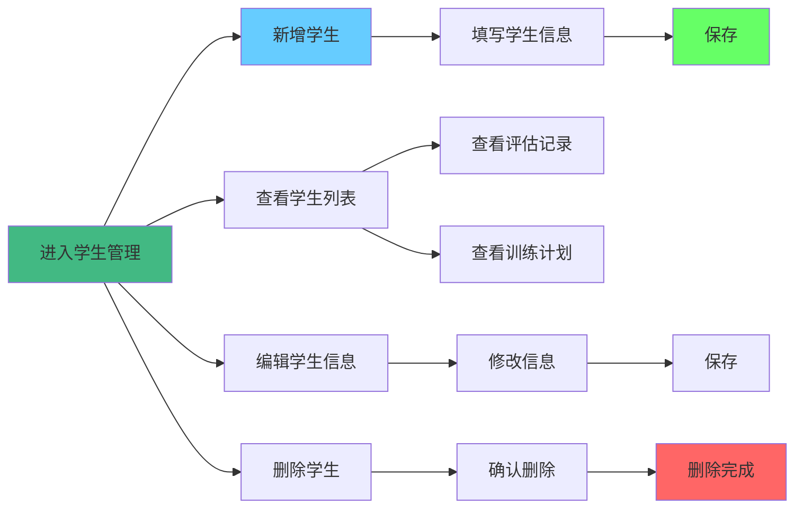
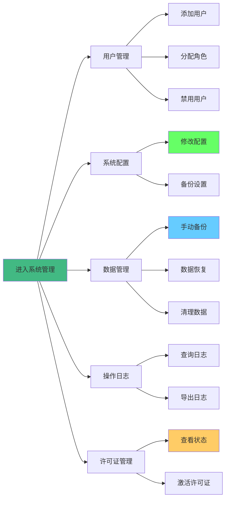

# 生活自理适应综合训练系统 - 使用说明书

> **产品名称**: 生活自理适应综合训练系统
> **文档版本**: v1.0.0
> **生成日期**: 2025-12-31
> **适用系统版本**: 1.0.0
> **版权所有**: ©2013-2026 杭州炫灿科技有限公司

---

## 📋 目录

- [第一章：快速开始](#第一章快速开始)
- [第二章：功能模块导览](#第二章功能模块导览)
- [第三章：角色操作手册](#第三章角色操作手册)
- [第四章：故障排查速查表](#第四章故障排查速查表)
- [第五章：常见问题解答](#第五章常见问题解答)

---

## 第一章：快速开始

### 1.1 系统简介

**生活自理适应综合训练系统**是一款专业的特殊教育和康复训练辅助软件，主要为特殊儿童、康复训练机构提供生活自理能力评估和训练支持。

#### 核心功能

✅ **学生信息管理** - 完整的学生档案管理
✅ **S-M 量表评估** - 专业的生活自理能力评估工具
✅ **WeeFIM 评估** - 国际通用的功能独立性评估
✅ **训练计划制定** - 个性化的训练方案
✅ **训练记录管理** - 全程跟踪训练进度
✅ **资源库管理** - 教学资源统一管理
✅ **数据导出** - 支持评估报告和数据导出

#### 适用场景

- 特殊教育学校
- 康复训练中心
- 儿童医院康复科
- 家庭康复训练
- 特殊儿童研究机构

### 1.2 最低配置环境准备

#### Windows 用户

| 项目 | 最低配置 | 推荐配置 |
|------|---------|---------|
| 操作系统 | Windows 10 64位 | Windows 11 64位 |
| 处理器 | 双核 2.0 GHz | 四核 3.0 GHz+ |
| 内存 | 4 GB | 8 GB+ |
| 硬盘空间 | 1 GB 可用空间 | 2 GB+ |
| 显示器 | 1366×768 | 1920×1080 |

#### Mac 用户

| 项目 | 最低配置 | 推荐配置 |
|------|---------|---------|
| 操作系统 | macOS 10.15+ | macOS 12.0+ |
| 处理器 | 双核 2.0 GHz | 四核 3.0 GHz+ |
| 内存 | 4 GB | 8 GB+ |
| 硬盘空间 | 1 GB 可用空间 | 2 GB+ |

#### Linux 用户

| 项目 | 最低配置 | 推荐配置 |
|------|---------|---------|
| 操作系统 | Ubuntu 20.04 LTS | Ubuntu 22.04 LTS |
| 处理器 | 双核 2.0 GHz | 四核 3.0 GHz+ |
| 内存 | 4 GB | 8 GB+ |
| 硬盘空间 | 1 GB 可用空间 | 2 GB+ |

### 1.3 一键检测环境脚本

```batch
@echo off
echo ========================================
echo 生活自理适应综合训练系统 - 环境检测
echo ========================================
echo.

:: 检测操作系统
echo [1/5] 检测操作系统...
ver
echo.

:: 检测内存
echo [2/5] 检测内存...
systeminfo | findstr /C:"可用物理内存"
echo.

:: 检测磁盘空间
echo [3/5] 检测磁盘空间...
wmic logicaldisk get name,freespace,size
echo.

:: 检测 .NET Framework（如果需要）
echo [4/5] 检测运行环境...
reg query "HKLM\SOFTWARE\Microsoft\NET Framework Setup\NDP\v4\Full" /v Version
echo.

echo [5/5] 检测完成！
echo.
echo 如果所有检测项都满足要求，可以正常安装使用本系统。
echo ========================================
pause
```

> 💡 **提示**: 将以上代码保存为 `check-env.bat` 并运行，自动检测环境是否满足要求。

### 1.4 5分钟部署指南

#### 步骤 1：下载安装包（1分钟）

从官方渠道下载对应操作系统的安装包：

- Windows: `生活自理适应综合训练_v1.0.0_Setup.exe`
- Mac: `生活自理适应综合训练_v1.0.0.dmg`
- Linux: `生活自理适应综合训练_v1.0.0.AppImage`

#### 步骤 2：安装应用（2分钟）

**Windows 安装步骤**：

1. 双击 `Setup.exe` 安装包
2. 选择安装目录（推荐默认路径）
3. 勾选"创建桌面快捷方式"
4. 点击"安装"按钮
5. 等待安装完成
6. 点击"完成"启动应用

**Mac 安装步骤**：

1. 双击 `.dmg` 文件
2. 将应用图标拖拽到"应用程序"文件夹
3. 在 Launchpad 或应用程序中找到应用
4. 双击启动（首次运行需要右键选择"打开"）

**Linux 安装步骤**：

1. 双击 `.AppImage` 文件
2. 给予执行权限：`chmod +x *.AppImage`
3. 双击运行或从命令行启动

#### 步骤 3：首次登录配置向导（2分钟）

1. **欢迎界面**

   系统首次启动后显示欢迎界面，点击"下一步"继续。

2. **管理员账户设置**

   - 输入用户名（如：admin）
   - 设置密码（建议 8 位以上，包含字母和数字）
   - 确认密码
   - 点击"下一步"

3. **系统信息配置**

   - 填写机构名称
   - 填写联系人信息
   - 点击"下一步"

4. **许可证激活**

   - 输入激活码（如有）
   - 或选择"试用模式"（30天试用）
   - 点击"激活"

5. **完成配置**

   - 系统显示"配置成功"
   - 点击"进入系统"

> ⚠️ **注意**: 请妥善保存管理员密码，忘记密码需要重装系统。

### 1.5 首次登录

1. 启动应用后，在登录界面输入：
   - 用户名：`admin`
   - 密码：刚才设置的密码

2. 点击"登录"按钮

3. 首次登录后，系统会显示引导向导，按提示完成基本设置。

---

## 第二章：功能模块导览

### 2.1 模块总览

系统包含以下核心模块：

| 模块名称 | 功能定位 | 适用人员 | 难度等级 |
|---------|---------|---------|---------|
| 📚 **学生管理** | 学生档案管理、信息维护 | 全部用户 | ⭐ |
| 📊 **S-M 评估** | 生活自理能力量表评估 | 教师/管理员 | ⭐⭐ |
| 📈 **WeeFIM 评估** | 改良儿童功能独立性评估 | 教师/管理员 | ⭐⭐ |
| 📋 **训练计划** | 制定个性化训练方案 | 教师/管理员 | ⭐⭐⭐ |
| ✅ **训练记录** | 记录训练过程和结果 | 教师/管理员 | ⭐⭐ |
| 📝 **报告生成** | 评估报告和训练报告导出 | 教师/管理员 | ⭐⭐ |
| 🎯 **训练任务** | 标准化训练任务管理 | 教师/管理员 | ⭐⭐ |
| 📁 **资源库** | 教学资源管理 | 全部用户 | ⭐ |
| ⚙️ **系统管理** | 系统配置、用户管理、数据管理 | 管理员 | ⭐⭐⭐ |

### 2.2 学生管理模块

#### 功能定位

解决什么痛点：
- ✅ 集中管理学生档案，避免信息分散
- ✅ 快速查找学生信息
- ✅ 跟踪学生评估和训练历史
- ✅ 便于教师共享学生信息

#### 操作流程图



#### 高频操作 3-5 步指南

**场景 1：添加新学生**

1. 点击"学生管理"菜单
2. 点击"新增学生"按钮
3. 填写学生信息（姓名、性别、出生日期等）
4. 点击"保存"按钮
5. ✅ 完成！

**场景 2：查找学生**

1. 在学生管理页面顶部搜索框
2. 输入学生姓名或学号
3. 点击"搜索"按钮或按回车
4. ✅ 找到目标学生！

**场景 3：查看学生评估历史**

1. 在学生列表中找到目标学生
2. 点击学生姓名或"查看详情"按钮
3. 在详情页点击"评估记录"标签
4. ✅ 查看所有评估历史！

#### 截图标注说明

（请参考实际界面）

- **A 区**：学生列表显示区域
- **B 区**：搜索和筛选工具栏
- **C 区**：操作按钮（新增、编辑、删除）
- **D 区**：分页控制
- **E 区**：统计信息（学生总数、男女比例等）

#### 常见问题与解决

| 问题 | 原因 | 解决方案 |
|------|------|---------|
| 无法保存学生信息 | 必填项未填写 | 检查标红的必填字段 |
| 学生重复添加 | 学号重复 | 确保学号唯一性 |
| 找不到学生 | 搜索条件不正确 | 尝试使用模糊搜索或清空筛选条件 |
| 删除学生时失败 | 学生有关联数据 | 先删除或解除关联的评估和训练记录 |

### 2.3 改良儿童功能独立性评估模块（WeeFIM）

#### 功能定位

解决什么痛点：
- ✅ 国际通用的功能独立性评估标准
- ✅ 全面评估儿童的生活自理能力
- ✅ 自动计算运动功能、认知功能和总分
- ✅ 提供量化的康复效果评估

#### WeeFIM 量表简介

WeeFIM（WeeFIM® Instrument）是专门评估儿童和青少年功能独立性的标准化工具，适用于6个月至21岁的人群。

**评估维度**：
- **运动功能**（13项）：包括自我照顾、括约肌控制、转移、移动、交流和社会认知
- **认知功能**（5项）：包括理解、表达、社会交往、问题解决和记忆

**评分标准**：
- 7分：完全独立
- 6分：有条件独立
- 5分：需要监督或准备
- 4分：最低限度辅助
- 3分：中度辅助
- 2分：最大程度辅助
- 1分：完全依赖

#### 操作流程图


#### 高频操作 6 步指南

**场景：完成一次 WeeFIM 评估**

1. 点击"WeeFIM 评估"菜单
2. 选择要评估的学生
3. 点击"开始评估"按钮
4. 依次填写运动功能13项（每项1-7分）
5. 依次填写认知功能5项（每项1-7分）
6. 点击"提交评估"按钮
7. ✅ 系统自动计算各项分数并显示结果！

#### 评分结果解读

| 分数范围 | 功能等级 | 说明 |
|---------|---------|------|
| 126分 | 完全独立 | 在所有项目中完全独立，无需辅助 |
| 108-125分 | 基本独立 | 绝大部分项目独立，少量需要辅助 |
| 90-107分 | 有条件独立 | 需要监督或准备 |
| 72-89分 | 部分依赖 | 需要最低限度到中度辅助 |
| 54-71分 | 中度依赖 | 需要中等到最大程度辅助 |
| 36-53分 | 重度依赖 | 绝大部分需要辅助 |
| 18-35分 | 极重度依赖 | 完全或几乎完全依赖他人 |

#### 与 S-M 量表的对比

| 对比项 | S-M 量表 | WeeFIM 量表 |
|-------|----------|-------------|
| **适用年龄** | 0-6岁儿童 | 6个月-21岁 |
| **评估维度** | 6大生活自理领域 | 运动功能 + 认知功能 |
| **题目数量** | 约60题（分年龄阶段） | 18题 |
| **评分方式** | 0分/1分（二值） | 1-7分（七级） |
| **评估重点** | 能否完成某项能力 | 完成某项的独立程度 |
| **使用场景** | 早期筛查和干预效果评估 | 全面评估和康复效果跟踪 |

#### 常见问题与解决

| 问题 | 原因 | 解决方案 |
|------|------|---------|
| 无法提交评估 | 有题目未作答 | 检查是否有遗漏的题目（共18题） |
| 分数计算不准确 | 题目理解偏差 | 参考评分标准重新评估 |
| 无法导出报告 | 评估未提交 | 先提交评估后再导出 |
| 与S-M评估结果差异大 | 量表评估维度不同 | 两者评估侧重点不同，都属于正常范围 |

### 2.4 训练计划模块

#### 功能定位

解决什么痛点：
- ✅ 制定个性化的训练方案
- ✅ 分阶段规划训练内容
- ✅ 指定训练难度和时长
- ✅ 便于教师跟踪训练进度

#### 操作流程图


#### 高频操作 5 步指南

**场景：为某个学生制定训练计划**

1. 点击"训练计划"菜单
2. 选择目标学生
3. 点击"新建计划"按钮
4. 从任务库中选择训练任务
5. 设置训练难度和周期
6. ✅ 保存训练计划！

#### 训练任务分类

| 分类 | 任务示例 | 难度 |
|------|---------|------|
| **个人卫生** | 洗手、刷牙、洗脸 | ⭐-⭐⭐⭐ |
| **饮食技能** | 使用餐具、独立进食 | ⭐⭐-⭐⭐⭐ |
| **穿衣技能** | 穿脱衣物、系鞋带 | ⭐⭐-⭐⭐⭐⭐ |
| **如厕训练** | 如厕、擦拭、冲水 | ⭐⭐-⭐⭐⭐ |
| **整理能力** | 收拾玩具、整理书包 | ⭐-⭐⭐⭐ |

### 2.5 训练任务模块

#### 功能定位

解决什么痛点：
- ✅ 标准化训练任务管理
- ✅ 提供难度分级和步骤指导
- ✅ 关联教学资源（视频、文档）
- ✅ 便于教师快速查找和分配训练任务

#### 训练任务分类

| 分类 | 任务示例 | 难度范围 | 适用年龄 |
|------|---------|---------|---------|
| **个人卫生** | 洗手、刷牙、洗脸、洗澡 | ⭐-⭐⭐⭐ | 3-8岁 |
| **饮食技能** | 使用勺子、使用筷子、独立进食 | ⭐⭐-⭐⭐⭐ | 3-8岁 |
| **穿衣技能** | 穿脱上衣、穿脱裤子、系鞋带、扣扣子 | ⭐⭐-⭐⭐⭐⭐ | 4-10岁 |
| **如厕训练** | 如厕、擦拭、冲水、整理衣物 | ⭐⭐-⭐⭐ | 3-6岁 |
| **整理能力** | 收拾玩具、整理书包、叠衣服 | ⭐-⭐⭐ | 4-10岁 |

#### 训练任务属性

每个训练任务包含以下属性：

| 属性 | 说明 | 示例 |
|------|------|------|
| **任务名称** | 训练任务的标题 | 洗手七步法 |
| **任务分类** | 所属的能力领域 | 个人卫生 |
| **难度等级** | 简单/中等/困难/进阶 | 中等 |
| **训练步骤** | 详细操作步骤 | 1.湿润双手 2.涂抹洗手液... |
| **教学资源** | 关联的视频、文档 | 示范视频.mp4 |
| **评估标准** | 完成质量的评判标准 | 能独立完成所有步骤 |
| **时长要求** | 建议训练时长 | 5-10分钟 |

#### 操作流程图


#### 高频操作 4 步指南

**场景 1：查看某个任务的详细信息**

1. 点击"训练任务"菜单
2. 在分类中选择目标分类（如"个人卫生"）
3. 在任务列表中找到目标任务
4. 点击任务名称查看详情（包含步骤、资源等）

**场景 2：下载任务相关资源**

1. 打开任务详情页面
2. 在"关联资源"区域找到资源列表
3. 点击资源名称
4. ✅ 资源自动下载到本地！

**场景 3：创建自定义任务**

1. 点击"训练任务" → "新建任务"
2. 填写任务名称、分类、难度
3. 添加训练步骤（支持添加多个步骤）
4. 关联教学资源（可选）
5. ✅ 保存任务！

#### 常见问题与解决

| 问题 | 原因 | 解决方案 |
|------|------|---------|
| 找不到需要的任务 | 任务未创建 | 联系管理员创建自定义任务 |
| 无法下载资源 | 网络问题 | 检查网络连接 |
| 任务步骤不清晰 | 描述过于简略 | 联系管理员完善任务描述 |
| 难度设置不合理 | 学生能力不匹配 | 在训练计划中调整难度等级 |

---

### 2.6 训练记录模块

#### 功能定位

解决什么痛点：
- ✅ 详细记录每次训练过程和结果
- ✅ 跟踪学生训练进度
- ✅ 生成训练统计报告
- ✅ 便于教师调整训练方案

#### 训练记录内容

每次训练记录包含以下信息：

| 字段 | 说明 | 示例 |
|------|------|------|
| **学生姓名** | 接受训练的学生 | 张三 |
| **训练任务** | 训练的具体任务 | 洗手七步法 |
| **训练日期** | 训练的日期和时间 | 2025-12-31 10:00 |
| **训练时长** | 实际训练时间（分钟） | 15 |
| **训练师** | 指导训练的教师/康复师 | 李老师 |
| **训练结果** | 训练完成情况 | 完成/部分完成/未完成 |
| **学生表现** | 学生训练时的表现评价 | 积极配合，掌握较好 |
| **备注说明** | 额外记录和说明 | 需要加强步骤2的练习 |

#### 操作流程图


#### 高频操作 5 步指南

**场景：记录一次训练**

1. 点击"训练记录"菜单
2. 选择学生和训练计划
3. 点击"添加记录"按钮
4. 填写训练信息（任务、时长、结果、表现等）
5. 点击"保存"按钮
6. ✅ 训练记录保存成功！

#### 训练结果分类

| 结果类型 | 说明 | 适用场景 |
|---------|------|---------|
| **完成** | 学生能够独立完成任务 | 训练效果良好 |
| **部分完成** | 学生在辅助下完成大部分任务 | 需要继续练习 |
| **未完成** | 学生无法完成任务 | 需要调整训练方案 |
| **有困难** | 学生完成任务但很吃力 | 建议降低难度 |

#### 训练统计功能

系统提供以下统计分析：

- **训练频次统计**：每周/每月训练次数
- **完成率统计**：训练完成/部分完成/未完成的比例
- **时长统计**：平均训练时长、总训练时长
- **进步趋势**：基于评估结果对比的进步曲线

#### 常见问题与解决

| 问题 | 原因 | 解决方案 |
|------|------|---------|
| 无法添加记录 | 训练计划不存在 | 先为学生创建训练计划 |
| 统计数据不准确 | 训练记录不完整 | 补充缺失的训练记录 |
| 无法查看历史记录 | 记录被误删除 | 从备份恢复数据库 |

---

### 2.7 报告生成模块

#### 功能定位

解决什么痛点：
- ✅ 自动生成标准化的评估报告
- ✅ 支持多种导出格式（Word、PDF）
- ✅ 图表化展示评估结果
- ✅ 便于归档和分享

#### 报告类型

系统支持生成以下类型报告：

| 报告类型 | 内容说明 | 导出格式 | 适用场景 |
|---------|---------|---------|---------|
| **S-M 评估报告** | 评估分数、等级、各领域得分、建议 | Word、PDF | 评估后反馈给家长/医生 |
| **WeeFIM 评估报告** | 运动功能得分、认知功能得分、总分、对比分析 | Word、PDF | 评估后反馈给家长/医生 |
| **训练报告** | 训练记录、完成率、进步情况 | Word、PDF | 定期向家长汇报训练进展 |
| **学生档案报告** | 学生基本信息、所有评估历史、所有训练记录 | Word、PDF | 转学或转机构时移交 |
| **综合评估报告** | 包含所有量表评估结果和对比分析 | Word、PDF | 全面评估会议使用 |

#### 报告内容结构

**S-M 评估报告结构**：
1. **封面信息**：学生信息、评估日期、评估人
2. **评估概览**：总分、标准分、等级
3. **各领域得分**：6大生活自理领域的得分详情
4. **评估详情**：每个题目的得分和说明
5. **结果分析**：根据常模对比分析
6. **训练建议**：针对性的训练建议

**WeeFIM 评估报告结构**：
1. **封面信息**：学生信息、评估日期、评估人
2. **评估概览**：运动功能得分、认知功能得分、总分
3. **运动功能详情**：13项运动功能题目得分
4. **认知功能详情**：5项认知功能题目得分
5. **结果分析**：功能独立性等级判断
6. **康复建议**：基于评估结果的康复建议

#### 操作流程图


#### 高频操作 5 步指南

**场景 1：导出单次评估报告**

1. 进入评估模块（S-M 或 WeeFIM）
2. 在评估列表中找到目标评估
3. 点击"生成报告"按钮
4. 选择导出格式（Word 或 PDF）
5. ✅ 报告自动下载到本地！

**场景 2：批量生成学生报告**

1. 点击"报告生成"菜单
2. 选择学生和时间范围
3. 选择报告类型
4. 点击"批量生成"按钮
5. ✅ 所有报告生成并打包下载！

**场景 3：自定义报告内容**

1. 在报告预览页面点击"自定义"
2. 选择需要包含的内容模块
3. 添加或修改备注和建议
4. 点击"保存模板"（下次可复用）
5. ✅ 生成自定义报告！

#### 报告自定义选项

| 自定义项 | 说明 | 操作方式 |
|---------|------|---------|
| **报告标题** | 自定义报告标题 | 在预览页面修改 |
| **内容模块** | 选择包含哪些部分 | 勾选/取消勾选模块 |
| **图表展示** | 选择是否包含图表 | 勾选"包含图表" |
| **备注建议** | 添加额外的备注和建议 | 在备注区域填写 |
| **页眉页脚** | 自定义页眉页脚信息 | 在设置中配置 |
| **Logo** | 添加机构 Logo | 在设置中上传 |

#### 常见问题与解决

| 问题 | 原因 | 解决方案 |
|------|------|---------|
| 报告导出失败 | 评估未提交或数据不完整 | 确认评估已提交且数据完整 |
| PDF 格式错乱 | 字体不支持 | 选择 Word 格式或调整字体 |
| 无法批量生成 | 学生数量过多 | 分批生成，每次不超过 10 人 |
| 报告内容错误 | 模板配置错误 | 检查报告模板设置 |

---

### 2.8 资源库模块

#### 功能定位

解决什么痛点：
- ✅ 统一管理教学资源
- ✅ 快速查找和下载资源
- ✅ 分类管理不同类型资源
- ✅ 支持资源上传和共享

#### 资源分类

| 分类 | 包含内容 | 文件类型 |
|------|---------|---------|
| **教学文档** | 教学计划、课程大纲 | PDF、Word |
| **示范视频** | 生活自理技能示范 | MP4、AVI |
| **PPT课件** | 教学演示课件 | PPTX |
| **案例分析** | 评估案例报告 | PDF、Word |
| **图片素材** | 步骤图、表情卡片 | PNG、JPG |
| **音频资源** | 语音提示、背景音乐 | MP3 |

#### 高频操作 3 步指南

**场景：查找并下载示范视频**

1. 点击"资源库"菜单
2. 在分类中选择"示范视频"
3. 在搜索框输入"洗手"
4. 找到目标视频，点击"下载"按钮
5. ✅ 资源下载完成！

---

### 2.9 系统管理模块

#### 功能定位

解决什么痛点：
- ✅ 集中管理用户和权限
- ✅ 系统配置和维护
- ✅ 数据备份和恢复
- ✅ 操作日志审计
- ✅ 许可证管理

#### 系统管理子模块

系统管理模块包含以下子模块：

| 子模块名称 | 功能说明 | 操作权限 |
|-----------|---------|---------|
| **用户管理** | 添加、编辑、删除用户，分配角色 | 管理员 |
| **角色管理** | 定义角色和权限 | 管理员 |
| **系统配置** | 修改系统参数和设置 | 管理员 |
| **数据管理** | 数据备份、恢复、清理 | 管理员 |
| **操作日志** | 查看用户操作记录 | 管理员/教师 |
| **许可证管理** | 查看、激活、撤销许可证 | 管理员 |

#### 用户管理

**用户角色定义**：

| 角色 | 权限范围 | 典型用户 |
|------|---------|---------|
| **admin（管理员）** | 所有权限 | 系统管理员、校长 |
| **teacher（教师）** | 学生管理、评估、训练、资源 | 教师、康复师 |
| **auditor（审计员）** | 仅查看权限 | 外部评估专家、督导 |

**用户信息包含**：

| 字段 | 说明 | 必填 |
|------|------|------|
| 用户名 | 登录账号，必须唯一 | ✅ |
| 密码 | 登录密码，建议 8 位以上 | ✅ |
| 真实姓名 | 显示名称 | ✅ |
| 角色 | admin/teacher/auditor | ✅ |
| 所属部门 | 机构部门 | ❌ |
| 联系电话 | 联系方式 | ❌ |
| 电子邮箱 | 邮箱地址 | ❌ |
| 状态 | 启用/禁用 | ✅ |

#### 系统配置

系统配置包含以下设置项：

| 配置类别 | 配置项 | 说明 | 默认值 |
|---------|-------|------|--------|
| **基本信息** | 机构名称 | 显示在系统标题 | 杭州炫灿科技有限公司 |
| **基本信息** | 联系人 | 技术支持联系人 | - |
| **基本信息** | 联系电话 | 技术支持电话 | - |
| **数据管理** | 自动备份频率 | 每日/每周 | 每日 |
| **数据管理** | 备份保留天数 | 保留备份的天数 | 7 天 |
| **数据管理** | 数据库压缩 | 是否压缩数据库 | 是 |
| **评估设置** | S-M 评估时限 | 评估最大时长（分钟） | 30 分钟 |
| **评估设置** | WeeFIM 评估时限 | 评估最大时长（分钟） | 45 分钟 |
| **训练设置** | 默认训练时长 | 训练默认时长（分钟） | 15 分钟 |
| **界面设置** | 语言 | 系统语言 | 简体中文 |
| **界面设置** | 主题 | 界面配色主题 | 浅色 |

#### 操作日志

系统记录以下操作日志：

| 操作类型 | 记录内容 | 示例 |
|---------|---------|------|
| 用户登录 | 用户名、登录时间、IP | admin 于 2025-12-31 10:00 登录 |
| 用户登出 | 用户名、登出时间 | admin 于 2025-12-31 18:00 登出 |
| 数据修改 | 操作类型、记录 ID、修改内容 | 修改学生 张三 的姓名 |
| 数据删除 | 操作类型、记录 ID、删除内容 | 删除评估记录 ID:123 |
| 数据导出 | 导出类型、记录数量 | 导出学生数据 50 条 |
| 配置修改 | 配置项、旧值、新值 | 修改自动备份频率：每日→每周 |

日志查询功能：

- **按时间范围查询**：选择起止日期
- **按用户查询**：选择特定用户
- **按操作类型查询**：筛选特定操作类型
- **导出日志**：导出为 Excel 文件

#### 许可证管理

**许可证信息查看**：

| 信息项 | 说明 |
|-------|------|
| **许可证类型** | 试用版/标准版/企业版 |
| **激活码** | 系统激活码 |
| **机器码** | 当前机器的唯一标识 |
| **激活日期** | 许可证激活的日期 |
| **到期日期** | 许可证到期日期 |
| **剩余天数** | 距离到期还有多少天 |
| **许可证状态** | 激活/已过期/已撤销 |

**许可证类型对比**：

| 类型 | 时限 | 功能限制 | 价格 |
|------|------|---------|------|
| **试用版** | 30 天 | 功能完整 | 免费 |
| **标准版** | 1 年 | 完整功能 | 详询 |
| **企业版** | 永久 | 完整功能 + 多机绑定 | 详询 |

#### 操作流程图



#### 高频操作 4 步指南

**场景 1：添加新教师用户**

1. 点击"系统管理" → "用户管理"
2. 点击"新增用户"按钮
3. 填写用户名、密码、真实姓名
4. 选择角色为"teacher"，点击"保存"
5. ✅ 新用户添加成功！

**场景 2：修改自动备份配置**

1. 点击"系统管理" → "系统配置"
2. 找到"数据管理"配置区域
3. 修改"自动备份频率"为"每周"
4. 修改"备份保留天数"为"30 天"
5. 点击"保存"按钮
6. ✅ 配置修改成功！

**场景 3：查询特定用户的操作日志**

1. 点击"系统管理" → "操作日志"
2. 在用户选择框中选择目标用户
3. 选择时间范围（如本月）
4. 点击"查询"按钮
5. ✅ 显示该用户的所有操作记录！

**场景 4：检查许可证状态**

1. 点击"系统管理" → "许可证管理"
2. 查看许可证信息面板
3. 确认许可证状态为"激活"
4. 查看剩余天数
5. ✅ 了解许可证使用情况！

#### 常见问题与解决

| 问题 | 原因 | 解决方案 |
|------|------|---------|
| 无法添加用户 | 用户名已存在 | 更换用户名后再试 |
| 配置保存失败 | 配置值不合法 | 检查配置项的取值范围 |
| 无法恢复数据 | 备份文件损坏 | 使用其他备份文件 |
| 操作日志查询慢 | 日志数据量过大 | 缩短查询时间范围 |
| 许可证即将到期 | 时间到期提醒 | 联系销售续费 |

---

## 第三章：角色操作手册

### 3.1 普通用户（教师）操作手册

#### 高频操作清单

| 操作名称 | 使用频率 | 预计耗时 |
|---------|---------|---------|
| 查看学生信息 | 每天 | 1 分钟 |
| 完成评估 | 每周 | 10-30 分钟 |
| 记录训练情况 | 每天 | 5-10 分钟 |
| 下载教学资源 | 每周 | 2-5 分钟 |

#### 操作 1：查看学生信息（3 步）

1. 登录系统后，点击左侧菜单"学生管理"
2. 在学生列表中找到目标学生
3. 点击学生姓名查看详细信息

#### 操作 2：完成评估（5 步）

1. 进入评估模块（S-M 或 WeeFIM）
2. 选择要评估的学生
3. 点击"开始评估"
4. 依次回答所有评估题目
5. 点击"提交"，等待系统自动评分

#### 操作 3：记录训练情况（4 步）

1. 进入"训练记录"模块
2. 找到对应的训练计划
3. 点击"添加记录"
4. 填写训练内容、时长、结果，点击"保存"

### 3.2 管理员操作手册

#### 高频操作清单

| 操作名称 | 使用频率 | 预计耗时 |
|---------|---------|---------|
| 用户管理 | 每月 | 5-10 分钟 |
| 系统配置 | 按需 | 10-30 分钟 |
| 数据备份 | 每天（自动） | 1 分钟 |
| 日志查看 | 每周 | 5-15 分钟 |

#### 操作 1：添加新用户（4 步）

1. 点击"系统设置" → "用户管理"
2. 点击"新增用户"按钮
3. 填写用户名、密码、角色等信息
4. 点击"保存"

#### 操作 2：修改系统配置（3 步）

1. 点击"系统设置" → "系统配置"
2. 找到需要修改的配置项
3. 修改后点击"保存"

#### 操作 3：查看操作日志（3 步）

1. 点击"系统设置" → "操作日志"
2. 选择日期范围或用户
4. 查看详细的操作记录

### 3.3 运维人员操作手册

#### 监控指标解读

| 指标名称 | 正常范围 | 异常处理 |
|---------|---------|---------|
| 应用启动时间 | < 2 秒 | > 5 秒检查系统配置 |
| 内存占用 | < 500 MB | > 1 GB 重启应用 |
| 数据库大小 | < 100 MB | > 500 MB 清理历史数据 |
| 评估成功率 | > 95% | < 90% 检查系统日志 |

#### 备份恢复

**自动备份配置**：
- 备份频率：每天一次
- 保留份数：最近 7 天
- 备份位置：系统安装目录 /backups

**手动备份步骤**：

1. 点击"系统设置" → "数据备份"
2. 点击"立即备份"按钮
3. 选择备份保存位置
4. 等待备份完成

**数据恢复步骤**：

1. 点击"系统设置" → "数据恢复"
2. 选择备份文件
3. 点击"恢复"按钮
4. 确认恢复操作（⚠️ 会覆盖当前数据）

#### 紧急预案

| 故障类型 | 紧急处理 | 后续措施 |
|---------|---------|---------|
| 应用无法启动 | 重启应用/重装 | 联系技术支持 |
| 数据丢失 | 从备份恢复 | 检查自动备份 |
| 许可证失效 | 重新激活 | 联系销售获取新激活码 |
| 系统卡顿 | 清理缓存/重启 | 检查硬件配置 |

---

## 第四章：故障排查速查表

### 4.1 常见问题速查表

| 现象 | 可能原因 | 排查命令/方法 | 解决方案 |
|-----|---------|--------------|---------|
| **登录失败** | 用户名或密码错误 | 检查输入是否正确 | 重置密码或联系管理员 |
| **应用无法启动** | 数据库文件损坏 | 查看错误日志 | 恢复备份数据库 |
| **页面加载缓慢** | 网络问题或数据量大 | 检查网络连接 | 清理缓存或升级硬件 |
| **无法保存数据** | 权限不足 | 检查应用权限 | 以管理员身份运行 |
| **评估报告导出失败** | 临时目录无权限 | 检查 temp 目录权限 | 修改临时目录路径 |
| **许可证验证失败** | 机器码变化 | 重新获取机器码 | 重新激活许可证 |
| **数据同步失败** | 网络中断 | 检查网络连接 | 等待网络恢复后重试 |
| **内存占用过高** | 长时间未重启 | 查看任务管理器 | 重启应用 |
| **视频无法播放** | 编码不支持 | 更新播放器组件 | 转换视频格式 |
| **搜索功能异常** | 索引损坏 | 重建索引 | 使用系统工具修复 |

### 4.2 错误代码速查表

| 错误代码 | 错误描述 | 原因 | 解决方案 |
|---------|---------|------|---------|
| **E001** | 数据库连接失败 | 数据库文件损坏 | 恢复备份 |
| **E002** | 用户名或密码错误 | 认证失败 | 重新输入或重置密码 |
| **E003** | 许可证已过期 | 试用期结束 | 购买正式许可证 |
| **E004** | 磁盘空间不足 | 存储已满 | 清理磁盘空间 |
| **E005** | 网络连接失败 | 无法访问服务器 | 检查网络设置 |
| **E006** | 文件读写权限不足 | 权限被拒绝 | 以管理员身份运行 |
| **E007** | 数据验证失败 | 输入数据格式错误 | 检查输入格式 |
| **E008** | 并发访问冲突 | 数据被锁定 | 等待后重试 |

---

## 第五章：常见问题解答

### 5.1 安装和启动相关

**Q1: 安装时提示"无法写入文件"怎么办？**

A: 请以管理员身份运行安装程序。Windows 用户右键选择"以管理员身份运行"，Mac 用户使用 sudo 命令。

**Q2: 应用启动后闪退怎么办？**

A: 检查是否满足系统最低配置要求，查看错误日志文件（logs/error.log），或重新安装应用。

**Q3: 如何卸载应用？**

A: Windows：在"控制面板" → "程序和功能"中找到应用，点击"卸载"。Mac：将应用拖到废纸篓。Linux：删除 AppImage 文件和配置目录。

### 5.2 使用操作相关

**Q4: 如何修改密码？**

A: 登录后，点击右上角用户头像 → "个人设置" → "修改密码"，输入旧密码和新密码后保存。

**Q5: 学生数据能否导出？**

A: 可以。在学生管理页面，点击"导出"按钮，选择导出格式（Excel/CSV），即可导出学生数据。

**Q6: 如何批量添加学生？**

A: 支持从 Excel 文件导入学生数据。点击"批量导入"按钮，下载模板，填写后上传导入。

### 5.3 数据和备份相关

**Q7: 数据保存在哪里？**

A: 数据保存在本地 SQLite 数据库文件中，位置：
- Windows: `%APPDATA%\selfcare-ats\database.db`
- Mac: `~/Library/Application Support/selfcare-ats/database.db`
- Linux: `~/.config/selfcare-ats/database.db`

**Q8: 如何迁移数据到新电脑？**

A: 复制数据库文件到新电脑的相同位置即可。建议先导出评估报告作为备份。

**Q9: 自动备份是否可靠？**

A: 系统每天自动备份，保留最近 7 天的备份。建议定期手动备份到外部存储。

### 5.4 许可证相关

**Q10: 试用版有什么限制？**

A: 试用版功能完整，仅限制使用时间为 30 天，到期后需要激活正式许可证。

**Q11: 如何获取机器码？**

A: 登录系统后，点击"系统设置" → "许可证管理"，可以看到当前机器的机器码。

**Q12: 许可证可以迁移到新电脑吗？**

A: 可以。在旧电脑上撤销许可证，然后在新电脑上使用相同的激活码激活。

### 5.5 性能和优化相关

**Q13: 应用运行卡顿怎么办？**

A: 尝试以下方法：
1. 重启应用
2. 清理浏览器缓存（如果使用 Web 版）
3. 检查系统资源占用
4. 升级硬件配置（内存、CPU）

**Q14: 评估时页面加载慢？**

A: 可能是数据库过大，可以：
1. 清理历史评估数据
2. 压缩数据库文件
3. 升级硬件配置

---

## 📞 技术支持与联系方式

### 客服支持

- **技术热线**: 400-XXX-XXXX
- **技术邮箱**: support@example.com
- **工作时间**: 周一至周五 9:00-18:00

### 在线资源

- **官方网站**: www.example.com
- **在线文档**: docs.example.com
- **视频教程**: video.example.com
- **用户社区**: community.example.com

### 反馈与建议

我们非常重视用户的反馈，如果您有任何建议或遇到问题，请通过以下方式联系我们：

- 在线反馈表单
- 邮件反馈
- 用户社区发帖

---

## 附录

### 附录 A：快捷键列表

| 功能 | Windows/Linux | Mac |
|------|--------------|-----|
| 保存 | Ctrl + S | Cmd + S |
| 新增 | Ctrl + N | Cmd + N |
| 编辑 | Ctrl + E | Cmd + E |
| 删除 | Delete | Delete |
| 搜索 | Ctrl + F | Cmd + F |
| 全选 | Ctrl + A | Cmd + A |
| 打印 | Ctrl + P | Cmd + P |
| 帮助 | F1 | F1 |

### 附录 B：版本历史

| 版本 | 日期 | 更新内容 |
|------|------|---------|
| v1.0.0 | 2025-12-31 | 初始版本发布 |

---

**文档结束**

> 版权所有 ©2013-2026 杭州炫灿科技有限公司
> 未经许可，不得复制、传播本文档的部分或全部内容。
